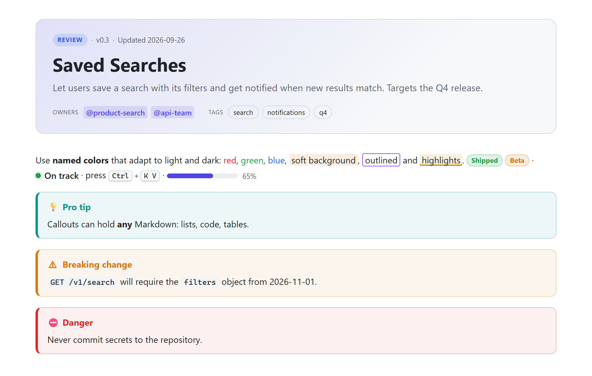
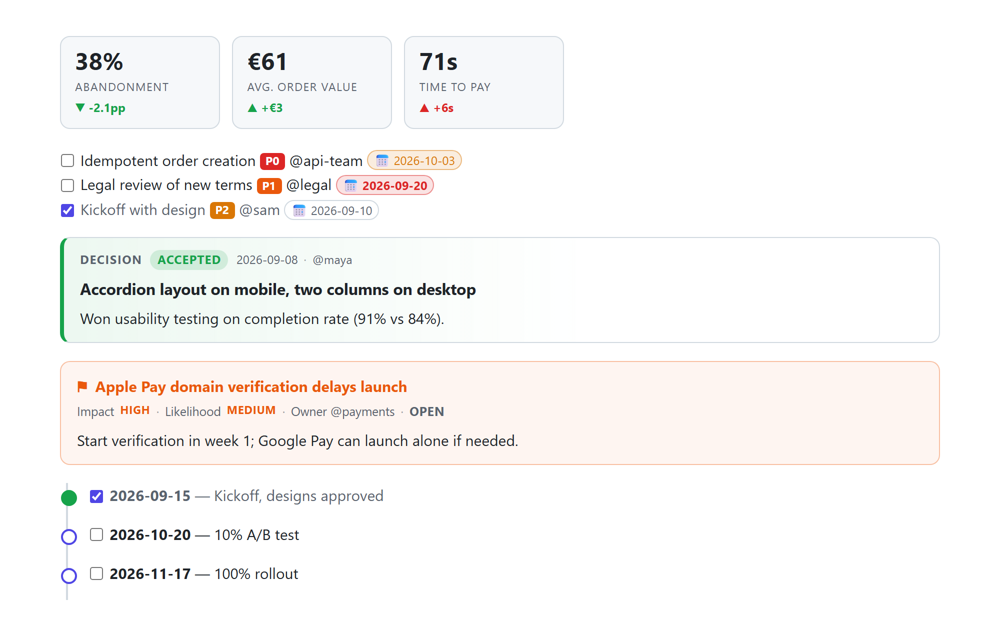
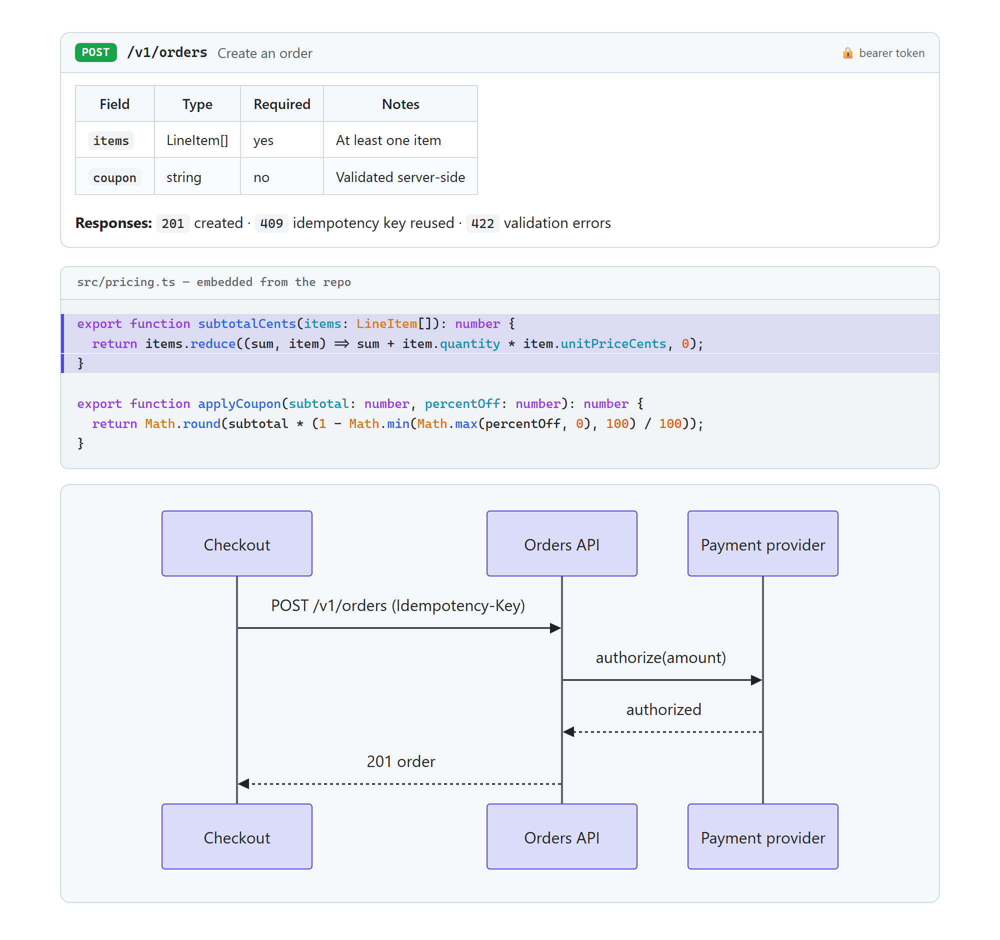
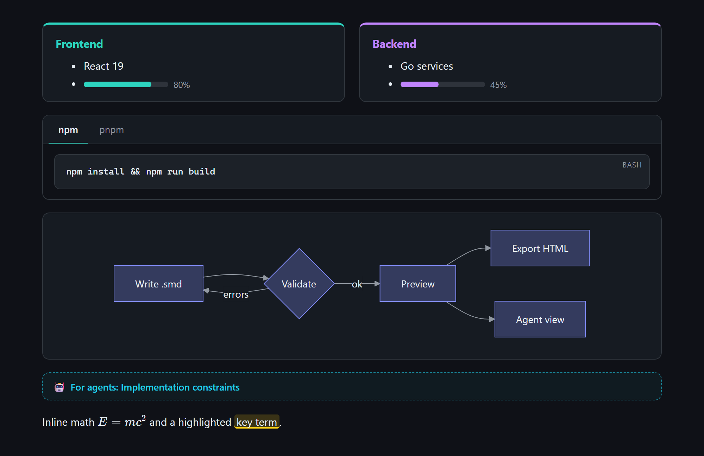
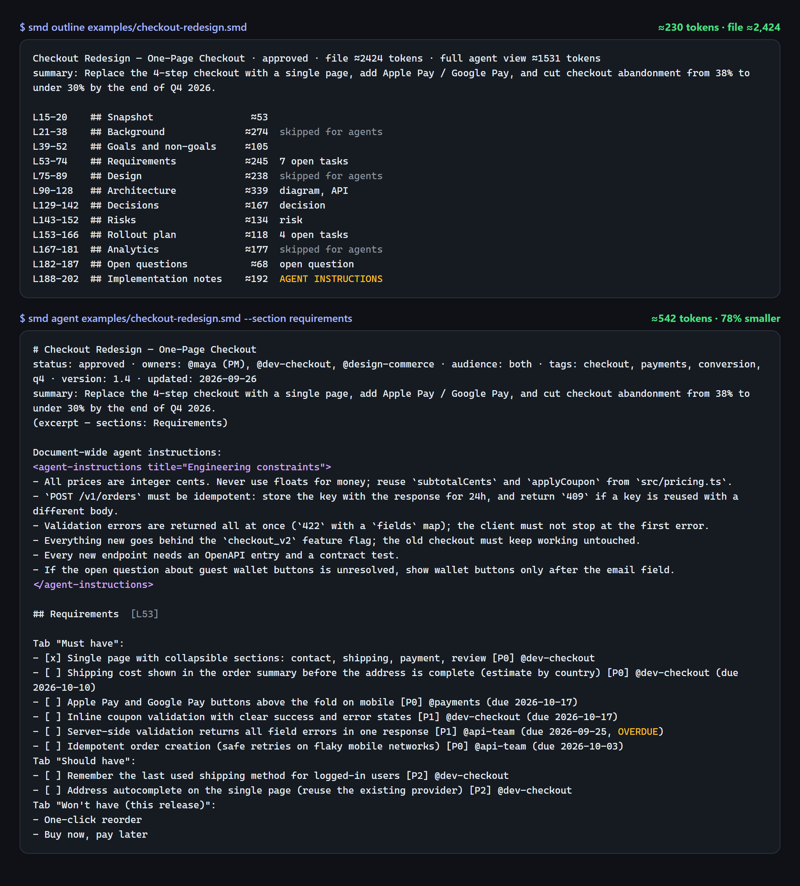

<p align="center">
  
</p>

<h1 align="center">Styled Markdown (<code>.smd</code>)</h1>

<p align="center">
  <b>One document format for developers, product managers and AI agents.</b><br>
  Markdown plus callouts, colors, diagrams, decisions, risks, APIs and KPIs, with live preview, validation and token-efficient agent views.
</p>

<p align="center">
  <a href="https://github.com/bislink360/styled-markdown/releases/latest"></a>
  
  <a href="LICENSE"></a>
</p>

<p align="center">
  <a href="#install">Install</a> ·
  <a href="docs/FEATURES.md">Feature guide</a> ·
  <a href="docs/SKILLS.md">Agent skills</a> ·
  <a href="examples/">Examples</a> ·
  <a href="docs/SPEC.md">Specification</a>
</p>

---



## Why Styled Markdown?

Markdown is the lingua franca of engineering docs, but teams keep stretching it. `**IMPORTANT:**` stands in for warnings, raw HTML for color and layout, and nobody finds a broken diagram until someone opens the file. AI agents reading those docs spend tokens on decoration and history, and can't tell a hard constraint from a side note.

`.smd` fixes this without leaving Markdown behind:

- **Every `.md` file is already a valid `.smd` file.** Rename it and add styling where it helps.
- **Meaning is explicit.** `:::warning`, `:::decision`, `:::risk`, `:::api` and `:::agent` say what content *is*, not just how it looks.
- **Everything is validated,** with rule codes and automatic fixes, in VS Code and in CI.
- **Agents read only what matters.** An *agent view* strips styling, layout and human-only sections, typically **cutting 37–85% of tokens** without losing meaning.
- **Safe and portable.** No scripts, whitelisted styles, and a one-command export to HTML or GitHub Markdown.

| | Developers | Product & project managers | AI agents |
|---|---|---|---|
| Write | API blocks, code highlights, live code embeds, diagrams, math | Decisions, risks, timelines, KPIs, task owners and due dates | A writer skill with 7 templates and a validator |
| Read | Syntax-highlighted preview, outline, folding | Status header, colored callouts, overdue tasks in red | A reader skill: outline → only the needed sections |
| Check | Problems panel + quick fixes, `smd validate` in CI | `smd tasks` across all docs, overdue first | `--json` diagnostics with machine-applicable fixes |

## At a glance

<table>
<tr>
<td width="50%"><br><sub><b>Project management:</b> KPI tiles, tasks with priority/owner/due date, decisions, risks, timelines</sub></td>
<td width="50%"><br><sub><b>Developers:</b> API endpoints, code embedded from the repo with line highlights, Mermaid diagrams</sub></td>
</tr>
<tr>
<td width="50%"><br><sub><b>Layout & theming:</b> cards, columns, tabs, diagrams, math. Light and dark follow VS Code.</sub></td>
<td width="50%"><br><sub><b>Agent view:</b> an outline with per-section token costs, then only the section needed (78% fewer tokens)</sub></td>
</tr>
</table>

## A taste of the syntax

````markdown
---
smd: 1
title: Saved Searches
summary: Let users save a search and get notified when new results match.
status: review
owners: ["@product-search"]
---

:metric[38%]{label="Abandonment" delta="-2.1pp" trend=down good=down}

:::warning Breaking change
`GET /v1/search` requires the `filters` object from 2026-11-01.
:::

- [ ] Idempotent order creation :priority[P0] @api-team :due[2026-10-03]

:::decision{status=accepted date=2026-09-08 owner=@maya} Accordion layout on mobile
Won usability testing on completion rate.
:::


## Background {agent=skip}
History and research. People see it; agents skip it.

:::agent
- All prices are integer cents.
:::
````

## Features

<details open>
<summary><b>Format</b> (full list in the <a href="docs/FEATURES.md">feature guide</a>)</summary>

| Area | Features |
|---|---|
| **Foundation** | 100% CommonMark + GFM (tables, task lists, autolinks) · YAML front matter with a status header, owners, tags, TOC and accent color |
| **Callouts** | `note` `info` `tip` `success` `warning` `danger` `question`, optionally collapsible · `details` |
| **Styling** | 14 theme-aware named colors · `[text]{color bg border size weight font style}` · `==highlight==` |
| **Inline** | `:badge` `:status` `:priority` `:due` `:metric` `:progress` `:kbd` `:mention` · inline and display math (KaTeX) |
| **Layout** | `tabs` · `columns` · `card` · `box` · `steps` · `timeline` (nest to any depth) |
| **Project management** | `decision` (ADR records) · `risk` (impact × likelihood) · tasks with owner, priority and due date · overdue detection |
| **Developers** | `api` endpoint blocks · code titles · line highlights `{2,5-7}` · live source embeds `file="…" lines="…"` · syntax highlighting |
| **Diagrams** | Every Mermaid type (flowchart, sequence, gantt, ER, state, class, pie, mindmap, timeline, xychart…), themed to match the document |
| **Audience** | `:::agent` (instructions for AI) · `:::human` (people only) · `## Heading {agent=skip}` |
| **Safety** | No scripts, whitelisted CSS values, sandboxed file embeds, strict Mermaid |

</details>

<details open>
<summary><b>VS Code extension</b></summary>

- **Live preview** (`Ctrl+K V`) with scroll sync, double-click to jump to source, clickable task checkboxes, and light/dark themes
- **Validation** as you type, with **quick fixes** (`:::warnign` → `:::warning`, `flowchat` → `flowchart`, `blu` → `blue`), and Mermaid syntax errors on the exact line
- **IntelliSense:** completions for blocks, directives, attributes, allowed values and front matter; paths and `#anchors` in links, `related:` and `file="…"` embeds; hover docs; color picker
- **Go to definition** for `#anchor` and `other.smd#anchor` links, files and reference links
- **Format Document** and format on save, with the same rules as `smd fmt`: container fences, attribute lists, table columns and blank lines
- **Find references** (`Shift+F12`) and **rename** (`F2`) for headings: renaming a heading updates every link to its anchor across the workspace
- **Refactorings** (`Ctrl+.`): wrap a selection in a callout, card, `:::details`, `:::agent` or `:::human`; change a callout's type; convert a `> **Warning:**` or `> [!WARNING]` blockquote into `:::warning`
- **Workspace symbols** (`Ctrl+T`) across every `.smd` heading, decision, risk and API endpoint (`POST /v1/orders`), and **hover previews** of linked sections, linked documents and `file="…"` code embeds
- **Editing comfort:** Enter continues task lists (unchecked, keeping `@owner`), bullets and numbered lists; paste or drop images to save them in `docs/images/` with a relative link; **Set Up Spell Checking** teaches cSpell to skip directives, attributes and code
- **Outline, folding** and **34 snippets** (`prd`-style blocks, `decision`, `risk`, `api`, `mermaid`, `gantt`, `task`, `embed`…)
- **Agent view** (🤖 button), **brief agent view**, **copy for an agent** (whole doc or picked sections), and a **status-bar token counter**
- **Export** to standalone HTML or plain GitHub Markdown · **Convert** `.md` → `.smd` · **Validate workspace**

</details>

<details open>
<summary><b>CLI (<code>smd</code>)</b></summary>

| Command | Purpose |
|---|---|
| `smd outline <file>` | Sections with line ranges and token costs |
| `smd agent <file> [--section …] [--brief]` | Compact agent view |
| `smd tasks <dir> [--mine @me]` | Open tasks across docs, overdue first |
| `smd query "<selector>" <paths> [--json]` | Decisions, risks, APIs, callouts, tasks or headings by type and attributes, e.g. `risk[impact>=high]` |
| `smd validate <paths> [--fix] [--json] [--strict]` | Check files (CI-friendly exit codes); rules configurable in `smd.config.json` / `.smdrc` and with `<!-- smd-disable-next-line code -->` |
| `smd fmt <paths> [--check]` | Format files in place; `--check` fails CI on unformatted files |
| `smd init <file> --template prd` | New doc from 7 templates (`smd templates` lists them) |
| `smd render` · `to-md` · `from-md` · `meta` | Convert and inspect |
| `smd skills install [--global]` | Install the agent skills |

</details>

<details open>
<summary><b>Agent skills</b></summary>

| Skill | What it teaches an agent |
|---|---|
| **`styled-markdown-writer`** | Create and edit `.smd` that follows every rule: choose a template (PRD, ADR, RFC, runbook, API, status report, meeting notes), fill it, validate with `--fix`, and keep it cheap for agents to read |
| **`styled-markdown-reader`** | Read `.smd` with minimal tokens: `outline` first, then only the relevant sections through the agent view, and raw lines only when editing |

</details>

## Install

### VS Code extension

1. Download **`styled-markdown-1.1.0.vsix`** from the [latest release](https://github.com/bislink360/styled-markdown/releases/latest).
2. Install it:

   ```bash
   code --install-extension styled-markdown-1.1.0.vsix
   ```

   Or in VS Code: **Extensions** view → **⋯** → **Install from VSIX…**
3. Open any `.smd` file and press **`Ctrl+K V`** (**`Cmd+K V`** on macOS).

> The VS Code Marketplace and npm listings are coming soon. Until then, every release on GitHub has the `.vsix`, the npm package and the skills.

### npm library and `smd` CLI

Install the package straight from the release:

```bash
npm install -g https://github.com/bislink360/styled-markdown/releases/download/v1.1.0/styled-markdown-1.1.0.tgz   # the smd command
npm install https://github.com/bislink360/styled-markdown/releases/download/v1.1.0/styled-markdown-1.1.0.tgz      # the library: render, validate, agent views (zero dependencies)
```

```ts
import { renderSmd, validateSmd, agentView } from 'styled-markdown';
```

See the [package README](npm/README.md) for the API.

Full instructions, building from source and troubleshooting: **[docs/INSTALL.md](docs/INSTALL.md)**.

### Agent skills

```bash
curl -sLo smd.cjs https://raw.githubusercontent.com/bislink360/styled-markdown/v1.1.0/skills/styled-markdown-reader/scripts/smd.cjs
node smd.cjs skills install --global
```

Or download `styled-markdown-reader.zip` and `styled-markdown-writer.zip` from the [latest release](https://github.com/bislink360/styled-markdown/releases/latest). This installs both skills into `~/.claude/skills/` for Claude Code. For Claude.ai, the Claude API / Agent SDK, Copilot, Cursor and other agents, see **[docs/SKILLS.md](docs/SKILLS.md)**.

## Token-efficient reading for agents

Measured on [`examples/checkout-redesign.smd`](examples/checkout-redesign.smd), a realistic ≈2,400-token PRD:

| How it's read | ≈ tokens | Saving |
|---|---:|---:|
| Raw file | 2,424 | — |
| `smd outline` | 230 | 90% |
| `smd agent` (whole doc) | 1,531 | 37% |
| `smd agent --section requirements` | 542 | 78% |
| `smd agent --section "open questions"` | 365 | 85% |
| `smd tasks examples/` vs. reading all 7 examples | 672 vs 7,258 | 91% |
| `smd query "decision, risk" examples/` vs. reading all 7 examples | 821 vs 7,258 | 89% |

The skill and CLI cost a few hundred tokens themselves, so the savings grow with document size, the number of documents, and repeated reads. [How it works →](docs/SKILLS.md#how-token-reduction-works)

## Examples

| File | Shows |
|---|---|
| [showcase.smd](examples/showcase.smd) | Every feature on one page |
| [checkout-redesign.smd](examples/checkout-redesign.smd) | A realistic PRD: requirements, API, decisions, risks, rollout, agent constraints |
| [feature-spec.smd](examples/feature-spec.smd) | A short product spec |
| [adr-0007-event-bus.smd](examples/adr-0007-event-bus.smd) | Architecture decision record |
| [runbook-payments-latency.smd](examples/runbook-payments-latency.smd) | On-call runbook with safe-automation rules |
| [api-orders.smd](examples/api-orders.smd) | API reference with endpoints and embedded source |
| [status-report-2026-09.smd](examples/status-report-2026-09.smd) | Weekly status report with KPIs, risks and decisions needed |

Each has a rendered `.html` version next to it that you can open in a browser. More in [examples/README.md](examples/README.md).

## Documentation

| Document | For |
|---|---|
| [docs/INSTALL.md](docs/INSTALL.md) | Installing, updating and building the extension and CLI |
| [docs/FEATURES.md](docs/FEATURES.md) | Feature guide: every construct with syntax, rendering, agent view and plain-Markdown fallback |
| [docs/SKILLS.md](docs/SKILLS.md) | Importing the agent skills into Claude Code, Claude.ai, the API/Agent SDK and other agents |
| [docs/AGENTS.md](docs/AGENTS.md) | One-page guide to paste into any agent's instructions |
| [docs/SPEC.md](docs/SPEC.md) | The formal specification (v1) and validation rules |

## Repository layout

```text
styled-markdown/
├── extension/            VS Code extension + smd CLI (TypeScript)
│   ├── src/core/         the engine: renderer, validator, agent view, converters (no VS Code dependency)
│   ├── src/              extension: preview, language features, agent view UI, CLI
│   ├── media/            preview CSS/runtime, icons
│   └── test/             unit tests + VS Code integration tests
├── skills/
│   ├── styled-markdown-reader/   agent skill: token-efficient reading
│   └── styled-markdown-writer/   agent skill: authoring, with templates and references
├── npm/                  the `styled-markdown` npm package (library + CLI)
├── examples/             example documents (+ rendered HTML)
└── docs/                 guides, specification, gallery and screenshots
```

## Development

```bash
cd extension
npm install
npm run build          # bundle extension + CLI; refresh the CLI bundled in skills/*/scripts
npm test               # 34 unit tests
npm run test:vscode    # 11 integration checks inside a real VS Code
npm run package        # → styled-markdown-1.1.0.vsix
npm run build:npm      # → ../npm/dist (the npm package)
```

Press **F5** in `extension/` to launch an Extension Development Host with the examples open. See [CONTRIBUTING.md](CONTRIBUTING.md).

## Author

**Roshan Alwis**, [bislink360](https://github.com/bislink360)

## License

[MIT](LICENSE)
