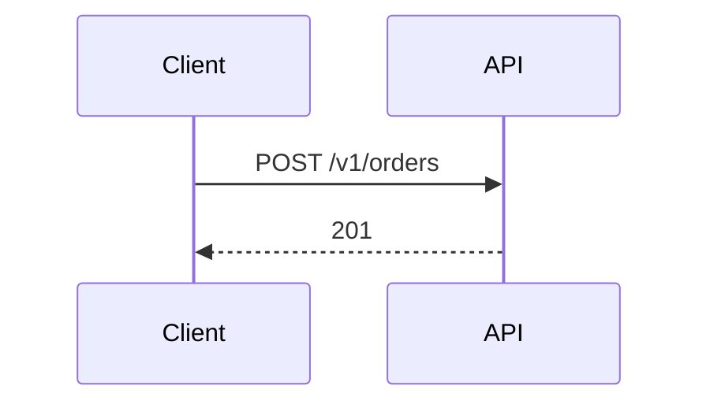

# Feature guide

Every Styled Markdown feature, with its syntax, what it renders, what an AI agent reads (the **agent view**), and what it becomes in plain GitHub Markdown (`smd to-md`). The formal rules are in [SPEC.md](SPEC.md).

## Contents

**Format**
1. [Documents and front matter](#1-documents-and-front-matter)
2. [Callouts and collapsibles](#2-callouts-and-collapsibles)
3. [Text styling and colors](#3-text-styling-and-colors)
4. [Inline directives](#4-inline-directives)
5. [Tasks with owners, priorities and due dates](#5-tasks-with-owners-priorities-and-due-dates)
6. [Project blocks: decisions, risks, timelines](#6-project-blocks-decisions-risks-timelines)
7. [Developer blocks: APIs, code, embeds](#7-developer-blocks-apis-code-embeds)
8. [Layout: tabs, columns, cards, boxes, steps](#8-layout-tabs-columns-cards-boxes-steps)
9. [Diagrams and math](#9-diagrams-and-math)
10. [Audience: agent, human, agent=skip](#10-audience-agent-human-agentskip)
11. [Headings, links and anchors](#11-headings-links-and-anchors)

**Tools**

12. [VS Code: preview](#12-vs-code-preview)
13. [VS Code: editing assistance](#13-vs-code-editing-assistance)
14. [VS Code: agent view and token counter](#14-vs-code-agent-view-and-token-counter)
15. [Validation and quick fixes](#15-validation-and-quick-fixes)
16. [Export and conversion](#16-export-and-conversion)
17. [CLI reference](#17-cli-reference)
18. [Templates](#18-templates)

---

## 1. Documents and front matter


```yaml
---
smd: 1
title: Saved Searches
summary: Let users save a search with its filters and get notified when new results match.
status: review            # draft | review | approved | deprecated | archived
owners: ["@product-search", "@api-team"]
tags: [search, q4]
version: 0.3
updated: 2026-09-26
accent: indigo            # accent color for headings, links, mentions
toc: true                 # table of contents
theme: auto               # auto | light | dark
---
```

- **Preview:** a header card with a status pill, version, date, owners and tags, plus an optional table of contents.
- **Agent view:** `# Saved Searches`, one `status: review · owners: … · tags: …` line, and `summary: …`.
- **Tip:** the `summary` is the first thing every agent reads. Make it self-contained.
- **Schema:** keys and values are completed and checked from one JSON Schema, published as [`smd-frontmatter.schema.json`](../extension/schemas/smd-frontmatter.schema.json) and as `styled-markdown/frontmatter.schema.json` on npm for YAML tooling and pipelines. Typing `updated: ` suggests today's date.
- **Status workflow:** in VS Code the status bar shows `status` and changes it, bumping `updated`; see [section 13](#13-vs-code-editing-assistance).
- **Staleness:** a live document whose `updated` date is more than 180 days old gets a `frontmatter/stale` hint. Bump `updated` after a review, or set `status: archived`. The threshold is set with `smd.validation.staleAfterDays` or `smd validate --stale-after <days>`, where `0` turns it off.

## 2. Callouts and collapsibles

```markdown
:::warning Breaking change
`GET /v1/search` requires the `filters` object from 2026-11-01.
:::

:::tip{collapsible} Advanced options
Starts collapsed. Use {collapsible=open} to start expanded.
:::

:::details Full log
Collapsed section for long content.
:::
```

| Type | Color | Use for | Agent view | GitHub Markdown |
|---|---|---|---|---|
| `note` | gray | neutral remark | `<note>` | `> [!NOTE]` |
| `info` | blue | background | `<info>` | `> [!NOTE]` |
| `tip` | teal | advice | `<tip>` | `> [!TIP]` |
| `success` | green | done / good | `<success>` | `> [!TIP]` |
| `warning` | amber | caveat | `<warning>` | `> [!WARNING]` |
| `danger` | red | hard constraint | `<danger>` | `> [!CAUTION]` |
| `question` | purple | open decision | `<question>` | `> [!IMPORTANT]` |
| `details` | — | long optional content | `<details>` (omitted with `--brief`) | `<details><summary>` |

## 3. Text styling and colors

```markdown
[red text]{color=red}  [soft background]{bg=amber}  [outlined]{border=purple}
[big bold]{size=lg weight=bold}  [code-like]{font=mono}  [removed]{style=strike}
[brand color]{color="#0ea5e9"}  ==highlighted==
```

| Attribute | Values |
|---|---|
| `color`, `bg`, `border` | `red` `orange` `amber` `yellow` `green` `teal` `cyan` `blue` `indigo` `purple` `pink` `gray` `muted` `accent`, or `#hex` / `rgb()` / `hsl()` |
| `size` | `xs` `sm` `md` `lg` `xl` `2xl` |
| `weight` | `normal` `medium` `bold` |
| `font` | `sans` `serif` `mono` |
| `style` | `italic` `underline` `strike` |
| `align` (blocks) | `left` `center` `right` |

Named colors are theme tokens tuned for light and dark mode. Only whitelisted values are rendered, so documents can't inject CSS. **Agent view:** plain text. **GitHub:** plain text (bold/italic/strike kept).

## 4. Inline directives

```markdown
:badge[Shipped]{color=green}   :status[At risk]{color=red}   :priority[P1]   :due[2026-10-15]
:metric[42%]{label="Activation" delta="+3%" trend=up}   :progress{value=65}   :kbd[Ctrl+K V]   :mention[@team]
```

| Directive | Renders | Agent view | GitHub |
|---|---|---|---|
| `:badge[x]{color}` | colored pill | `[x]` | `` `x` `` |
| `:status[x]{color}` | dot + label | `[status: x (ok/warn/bad)]` | `🟢 x` |
| `:priority[P0–P4]` | auto-colored pill (P0 red → P4 gray) | `[P0]` | `**P0**` |
| `:due[YYYY-MM-DD]` | date pill: amber ≤ 7 days, red overdue | `(due …, OVERDUE)` | `📅 …` |
| `:metric[v]{label delta trend good}` | KPI tile; the delta is green when it moves the `good` way | `label: v (delta)` | `**v** label (delta)` |
| `:progress{value color label}` | progress bar | `65%` | `▰▰▰▰▰▰▱▱▱▱ 65%` |
| `:kbd[Ctrl+S]` | key caps | `Ctrl+S` | `<kbd>Ctrl</kbd>+<kbd>S</kbd>` |
| `:mention[@x]` | highlighted mention | `@x` | `@x` |

## 5. Tasks with owners, priorities and due dates

```markdown
- [ ] Idempotent order creation :priority[P0] @api-team :due[2026-10-03]
- [ ] Legal review of new terms :priority[P1] @legal :due[2026-09-20]
- [x] Kickoff with design @sam
```

- **Preview:** checkboxes are clickable and update the source. Overdue dates turn red.
- **SMD Tasks view** (VS Code Explorer): open tasks from every `.smd` file in the workspace, grouped by owner, due date or document; see [section 13](#13-vs-code-editing-assistance).
- **Problems panel:** open tasks past their due date show a `task/overdue` notice.
- **`smd tasks docs/`** lists open tasks across every document, overdue first, then by priority. `--mine @api-team` filters by owner, `--json` gives machine-readable output, `--csv` and `--gantt` export (below).

```text
docs/checkout.smd:61  [ ] [P1] Server-side validation returns all field errors @api-team (due 2026-09-25, OVERDUE)  — Requirements
docs/checkout.smd:62  [ ] [P0] Idempotent order creation @api-team (due 2026-10-03)  — Requirements
```

- **`smd report docs/ --since 2026-09-01`** drafts a status report from what happened to these tasks since a date or Git revision (see [§6](#6-project-blocks-decisions-risks-timelines)).

### Export: CSV and a Gantt chart

`smd tasks` takes the same filters (`--all`, `--mine`) with one export format, printed or written with `-o <file>`:

- **`--csv`** for spreadsheets. RFC 4180: a header row, then one record per task with CRLF line endings, UTF-8 without a byte order mark (in Excel, open it with *Data → From Text/CSV*). Columns, always in this order: `file,line,done,text,owners,priority,due,overdue,section`. `line` is 1-based, as `smd tasks` prints it (`--json` and the library use zero-based lines). `done` and `overdue` are `true`/`false`, owners are joined with `;`. Fields with a comma, a quote or a line break are quoted, with quotes doubled.
  - **Formula guard:** a field that starts with `=`, `+`, `-`, `@`, a tab or a carriage return gets a leading `'`, so a spreadsheet shows it as text instead of running it as a formula. This includes owners: Excel reads `@maya` as a formula, so the cell is `'@maya;@li`. Use `--json` when a program, not a person, reads the export.
- **`--gantt`** prints a Mermaid `gantt` chart: `dateFormat YYYY-MM-DD`, one `section` per document, and one milestone per task on its due date, named by its text and owners. Done tasks (with `--all`) are marked `done`, overdue ones `crit`. Tasks without a real `YYYY-MM-DD` due date are left out; stderr says how many. `--title "…"` sets the chart title (default `Tasks`).
- **`--gantt --smd`** wraps the chart in a small `.smd` document with a `mermaid` fence, so `smd render` or the preview draws it.

```text
smd tasks docs/ --csv -o tasks.csv
smd tasks docs/ --all --gantt --smd --title "Q4 plan" -o timeline.smd
smd render timeline.smd -o timeline.html
```

```text
gantt
  title Q4 plan
  dateFormat YYYY-MM-DD
  section docs/checkout.smd
    Server-side validation returns all field errors @api-team :crit, milestone, 2026-09-25, 0d
    Idempotent order creation @api-team :milestone, 2026-10-03, 0d
```

Characters Mermaid would misread in a name (`:`, `#`, `;`, `%`) become Mermaid entity codes such as `#58;`, which the chart shows as the character itself. So does the first letter of a name that starts with a Gantt keyword (`title`, `click`, `section`…) or a date.

### Sync with GitHub Issues: `smd issues`

`smd issues docs/` keeps tasks and GitHub Issues in step, through your own [GitHub CLI](https://cli.github.com) (`gh`, logged in with `gh auth login`), so no token passes through smd. **It is a dry run unless you add `--apply`:** it reads the issues' states, prints the plan and changes nothing, on GitHub or on disk.

```bash
smd issues docs/                            # the plan only
smd issues docs/ --apply                    # check off tasks whose issue was closed
smd issues docs/ --apply --create --label backlog   # also open an issue for each open task without one
smd issues docs/ --apply --close            # also close the issue of each done task
```

A task is linked to an issue by a reference anywhere on its line, no new syntax. The first one counts, and references in code spans don't:

```markdown
- [ ] Ship the quote endpoint @api [#123](https://github.com/acme/shop/issues/123)
- [ ] Fix the flaky test https://github.com/acme/shop/issues/124
- [x] Kickoff with design acme/shop#125
```

A bare `#123` is not a link (it is too common in prose), and neither are pull request URLs.

| Task | Its issue | With `--apply` |
|---|---|---|
| open, no link | — | with `--create`: a new issue in `--repo` (default: the current folder's repository, from `gh repo view`); ` [#N](url)` is appended to the task line |
| open | closed as completed | the task is checked off (`- [ ]` → `- [x]`) |
| open | closed as not planned | left alone, listed under "Skipped" |
| done | open | with `--close`: the issue is closed as completed, with a comment pointing to the task |
| done, no link | — | left alone |

- **New issues:** the title is the task text without owner, priority, due date or emphasis. The body names the file, line and section, then owners, priority and due date. Owners are in code spans, so nobody is @-mentioned (an owner like `@api-team` may not be a GitHub user). `--label` adds labels (repeatable or comma-separated; they must exist in the repository).
- **Only the intended lines change:** a check-off changes the box, a new link is appended to the line. A task line that changed since it was read is not touched. Line endings (CRLF) are kept.
- **Idempotent:** a linked task never gets a second issue, and each issue is closed once, so running it again is safe.
- **Polite and stoppable:** one `gh` call at a time. The first failure stops the run; what was done, what failed and what was not run is reported. An issue that can't be read is skipped.
- **Exit codes:** 0 done (or nothing to do), 1 a `gh` call failed or an issue could not be read, 2 usage errors, and when `gh` is missing or not logged in to github.com. `--json` prints the plan or the results as JSON (`actions[]` with `kind`, `status`, `file`, `line`, `text`, `issue`; `skipped[]`; `inSync`).

```text
Dry run: nothing is changed. Add --apply to sync (--create to open issues, --close to close them).

Check off tasks whose issue was closed (1):
  docs/plan.smd:5  Fix the flaky test  acme/shop#120

Open issues for tasks without one in acme/shop (1):
  docs/plan.smd:4  Ship the quote endpoint  (needs --create)

Close issues whose task is done (1):
  docs/plan.smd:6  Kickoff with design  acme/shop#118  (needs --close)

[smd] dry run, nothing changed: 1 task(s) to check off, 1 issue(s) to create (needs --create), 1 issue(s) to close (needs --close); 1 in sync.
```

## 6. Project blocks: decisions, risks, timelines


```markdown
:::decision{status=accepted date=2026-09-08 owner=@maya} Accordion layout on mobile
Won usability testing on completion rate (91% vs 84%).
:::

:::risk{impact=high likelihood=medium owner=@payments status=open} Apple Pay verification delays launch
Start in week 1; Google Pay can launch alone.
:::

:::timeline
- [x] **2026-09-15** — Kickoff
- [ ] **2026-10-20** — 10% A/B test
:::
```

| Block | Attributes | Agent view |
|---|---|---|
| `decision` | `status`: proposed · accepted · rejected · superseded · deprecated; `date`; `owner` | `<decision status="accepted" …> title …</decision>` |
| `risk` | `impact`, `likelihood`: low · medium · high · critical; `owner`; `status`: open · mitigated · accepted · closed | `<risk impact="high" …> title …</risk>` |
| `timeline` | — (checked items show as done) | the list |
| `risk-matrix` | title after the name; no body | `[risk matrix: title — …]` pointer (the risks are already `<risk>` blocks) |

Rejected and superseded decisions are struck through in the preview. `smd meta` lists all decisions and risks as JSON.

### Risk register and risk matrix

Each risk is scored **impact × likelihood**, each level ranked `low` 1, `medium` 2, `high` 3, `critical` 4, so a score runs from 1 to 16. A missing or unknown level counts as `medium` (the spec's default impact) and is flagged, and a risk without `status` is `open`.

**`:::risk-matrix`** draws an impact × likelihood grid of the risks in the same document, cells coloured green → red by score and listing their risks (a risk with an `{#id}` links to its block). Closed risks are left out. In plain Markdown (`smd to-md`) it becomes a table, and in the agent view a one-line pointer.

```markdown
:::risk-matrix Launch risks
:::
```

**`smd risks`** is the register across documents: one line per risk, highest score first (then impact, then path and line), followed by a matrix of counts. Closed risks are left out unless `--all`; `--status open,accepted` and `--owner @name` filter, `--json` gives the register for tools, and `--html` a standalone page (light/dark) with the colour-coded matrix linking to the register table (`-o risks.html` writes it to a file).

```bash
smd risks docs/
smd risks docs/ --status open --owner @payments
smd risks docs/ --html -o risks.html
```

```text
docs/checkout.smd:145  [6] high×medium  Apple Pay domain verification delays launch  @payments  open  — Risks  → Verification needs the production domain and a certificate from the PSP.
docs/plan.smd:40  [4] medium?×medium?  Nobody has scored this yet  open  — Launch  → Impact and likelihood are missing.

impact ↓ likelihood →       low    medium      high  critical
critical                      ·         ·         ·         ·
high                          ·         1         ·         ·
medium                        ·         1         ·         ·
low                           ·         ·         ·         ·
```

`--json` prints `{ risks: [{ path, line, title, id?, impact, likelihood, score, owner, status, section, summary, defaulted }], matrix: { impact, likelihood, counts }, documents, documentsWithRisks }`; `line` is zero-based and `defaulted` lists the levels that were not set. The summary is a `Mitigation:` line from the body when there is one, else the body's first sentence.

**`smd query`** selects blocks across documents by type and attributes, and prints each one in the agent view (`--titles` for one line per block, `--json` for tools):

```bash
smd query "decision[status=accepted]" docs/
smd query "risk[impact>=high][status!=closed]" docs/
smd query "api[method=POST|PUT], question" docs/
smd query "task[owner=@api-team][due<today][done=false]" docs/
```

```text
docs/checkout.smd:145-147  risk  Apple Pay domain verification delays launch  {impact=high likelihood=medium owner=@payments status=open}  — Risks
```

| Selector part | Meaning |
|---|---|
| `decision`, `risk`, `api`, `warning`, … | Any container type. `callout` is any callout, `task` a task item, `heading` a heading with its section, `*` (or nothing) any block. `a, b` lists alternatives. |
| `[key]` | The attribute is set (and not `false`) |
| `[key=a\|b]` `[key!=v]` | Equals one of the values / none of them. Case-insensitive; a leading `@` is ignored. |
| `[key*=v]` `[key^=v]` `[key$=v]` | Contains / starts with / ends with |
| `[key<v]` `<=` `>` `>=` | Numbers, dates (`YYYY-MM-DD` or `today`), priorities (`P0` < `P1` …, `critical` = `P0`, `high` = `P1`) and risk levels (`low` < `medium` < `high` < `critical`) |

Every block also has `title`, `section` (the heading it sits under) and `type`. Defaults count: a decision without `status` is `proposed` and a risk without `impact` is `medium`. Tasks have `done`, `overdue`, `owner`, `priority` and `due`; headings have `level` and `id`. A misspelled type or attribute is an error with a suggestion, and the exit code is 1 when nothing matches.

**`smd decisions`** is the decision log across documents (an ADR index): every `:::decision`, newest date first and undated last, one line each with its location, date, status, title, owner and document › section:

```bash
smd decisions docs/                                   # everything
smd decisions docs/ --status accepted                 # binding decisions
smd decisions docs/ --status open --owner @maya       # still to decide (open = proposed)
smd decisions docs/ --md -o docs/decisions.smd        # an ADR index to commit
```

```text
docs/adr-0007-event-bus.smd:11  2026-09-18  [accepted]  Publish order events to AWS EventBridge  @platform  — ADR-0007: Use a managed event bus for order events
docs/checkout.smd:139  2026-09-11  [rejected]  Build our own wallet integration  @maya  — Checkout Redesign › Decisions
docs/adr-0007-event-bus.smd:44  2026-06-02  [superseded]  Add a retry queue in front of each HTTP consumer  @platform  — ADR-0007: Use a managed event bus for order events › Consequences
```

- `--status` takes a comma-separated list (`accepted,proposed`) of `proposed`, `accepted`, `rejected`, `superseded`, `deprecated`, or `open` for `proposed`. A decision without a status is `proposed`. `--owner @name` keeps decisions whose `owner` includes that name.
- `--json` prints one object per decision: `title`, `status`, `date`, `owner`, `path`, `line` and `endLine` (zero-based), `section`, `anchor` (the decision's `{#id}`, else its section's heading id), `document` (the document's title) and `adr`. `adr` is `true` for a document's own decision, as in an ADR: its first decision, when the document is tagged `adr` or the decision comes before any `##` section.
- `--md` prints an ADR index: front matter and a table of date, status badge, decision, owner and document, with each decision linked to its section (an ADR's own decision to its document) and rejected, superseded and deprecated ones struck through. Links are relative to the `-o` file (to the working directory without `-o`), so the index passes `smd validate` and `smd fmt --check`; `--title` sets its title. Regenerate it instead of editing it.

**`smd report`** drafts a status report (the `status-report` template) from how tasks and decisions changed since a Git commit, branch or tag, or a date:

```bash
smd report docs/ --since 2026-09-01 -o docs/status-2026-09-30.smd     # since the last commit before Sep 1
smd report docs/ --since v1.3.0 --title "Checkout squad"             # since a tag, to stdout
```

```text
[smd] Status report since 2026-09-01 (c1802c4) from 4 file(s): 5 done, 3 new, 1 removed; 9 open, 1 overdue, 2 due soon; 2 decision change(s), 1 high-impact risk(s).
```

- The draft has a **Summary** (status, progress and counts, with a line for you to replace; the front matter `summary` too), **Done since** (tasks that went from `[ ]` to `[x]`, and new tasks already done), **New since**, **Removed since** (only when tasks disappeared), **Open tasks** split into *Overdue*, *Due in the next 7 days* and *Other open tasks* (by priority), **Risks and blockers** (open risks with impact high or critical), **Decisions since** (new decisions, and ones whose status changed), **Decisions needed** (proposed decisions) and **Sources**. Each item links to its section (`docs/plan.smd#rollout`), relative to the `-o` file.
- `--since` takes a Git revision, or a date `YYYY-MM-DD` that means the last commit before that day (`git rev-list -1 --before=<date> HEAD`); the earlier version of each file is read with `git show`, and documents deleted since count too. Before the first commit, every task is new.
- Tasks have no ids, so a task is the same task when its document and text match (ignoring case and spacing); its owner, priority and due date may change. A reworded task shows up as removed and added. Decisions are matched by document and title the same way.
- Without Git history (outside a repository), `--since` a date reports the current state only and the draft says so; `--since` a revision is an error.
- Items are plain list entries, not tasks, decisions or risks of their own, so the report doesn't add to `smd tasks` or `smd decisions`, and it passes `smd validate --strict` and `smd fmt --check`. `-o` never overwrites a file: the draft is for you to edit. `--today` sets the date for overdue and due-soon tasks and the title.

## 7. Developer blocks: APIs, code, embeds


````markdown
:::api{method=POST path="/v1/orders" auth="bearer token"} Create an order
| Field | Type | Required |
| --- | --- | --- |
| `items` | LineItem[] | yes |

**Responses:** `201` created · `409` idempotency key reused
:::

```ts title="src/retry.ts" {2,4-5}
…code…
```

```ts file="../src/pricing.ts" lines="7-13"
```
````

| Feature | Details |
|---|---|
| `:::api` | Method badge (GET blue, POST green, PUT/PATCH amber, DELETE red…), path, auth. `method` and `path` are required. Agent view: `API POST /v1/orders — Create an order (auth: bearer token)`. |
| `title="…"` | File-name header on a code block |
| `{2,4-5}` | Highlighted lines (with `lines=`, the numbers refer to lines of the embedded file) |
| `file="…" lines="a-b"` | Embeds real source, so docs never drift from code. The preview refreshes on save, and the validator reports missing files or out-of-range lines. For safety, only files inside the workspace or the document's folder can be embedded. Agent view: `[code: path lines a-b — read that file]` (inline it with `--embed`). |
| Highlighting | 35+ languages (highlight.js), with a copy button on hover |

## 8. Layout: tabs, columns, cards, boxes, steps


```markdown
::::columns
:::column{width=60%}
:::card{accent=teal} Frontend
- React 19
:::
:::
:::column
Right side
:::
::::

::::tabs
:::tab npm
npm install
:::
:::tab pnpm
pnpm install
:::
::::

:::steps
1. Install
2. Configure
:::

:::box{bg=indigo align=center}
Any styled block.
:::
```

A bare `:::` closes the innermost block, so nesting works at any depth. Outer colons (`::::`) are optional but readable. Columns stack on narrow screens. **Agent view:** layout wrappers disappear and tab labels become `Tab "npm":`.

## 9. Diagrams and math

````markdown


Inline $E = mc^2$ and display:

$$
\int_0^1 x^2\,dx = \frac{1}{3}
$$
````

- **Mermaid:** every type is supported, colored from the document palette, and follows light/dark mode. The validator catches unknown diagram types (`flowchat` → `flowchart`).
- **Math:** KaTeX, inline and display, with syntax errors reported. `$5 and $10` stays plain text.
- **Agent view:** diagrams are kept (they're compact); `--brief` turns them into `[diagram: sequenceDiagram, 4 lines — see L10-L15]`.

## 10. Audience: agent, human, agent=skip

```markdown
## Background {agent=skip}
History and research. People see a "humans only" tag; agents skip the section.

:::human Thanks
People-only content anywhere in the document.
:::

:::agent Engineering constraints
- All prices are integer cents.
- If the open question is unresolved, show wallet buttons after the email field.
:::
```

| Construct | Preview | Agent view |
|---|---|---|
| `:::agent` | Collapsed "For agents" panel (configurable) | `<agent-instructions>`, **always included**, even when only one section is requested |
| `:::human` | "For humans" panel | omitted (unless `--include-human`) |
| `## … {agent=skip}` | "humans only" tag on the heading | whole section omitted |

## 11. Headings, links and anchors

- `## Title {#custom-id}` sets a stable anchor, and `{.lead}` adds a class.
- Headings get automatic ids, so `[see API](#api)` works. Broken anchors and missing relative files are reported.
- The outline view and folding follow headings and blocks.

---

## 12. VS Code: preview

| Feature | How |
|---|---|
| Open preview | `Ctrl+K V` (side) · `Ctrl+Shift+V` (current tab) · preview icon in the title bar |
| Live update | Updates as you type; embedded source files refresh on save. Updates keep your place: the same content stays at the top even when you add lines above it, unchanged Mermaid diagrams aren't redrawn, and the selected tab and opened/closed collapsibles stay as you left them, also after the preview tab was hidden. |
| Scroll sync | The preview follows the editor. **Double-click** in the preview to jump to that line. |
| Task toggling | Click a checkbox in the preview to update the source |
| Theme | Follows VS Code light/dark/high contrast. Override with `smd.preview.theme` or front matter `theme:`. |
| Security | A strict Content Security Policy: scripts in documents never run |

## 13. VS Code: editing assistance

| Feature | How |
|---|---|
| Syntax highlighting | Blocks, attributes, directives, math and front matter |
| Completions | After `:::` (blocks, with snippets for tabs/columns), `:` (directives), `{` (attributes), `=` (allowed values: colors, statuses, HTTP methods…), front matter keys and values, Mermaid types. In links (`](…`, `[label]: …`), `related:` entries and `file="…"` embeds: relative files and folders, then after `#` the headings and ids of this or the linked document |
| Hover | Documentation for blocks and directives |
| Color picker | Swatches next to `color=`, `bg=`, `border=`, `accent:` |
| Outline & folding | Headings in the Outline view; fold blocks, code and front matter |
| Go to definition | `F12` or `Ctrl+Click` on `#anchor`, `other.smd#anchor`, a relative file, a `related:` entry or a `[text][label]` reference jumps to the heading, `{#id}` block, file or definition |
| Format Document | `Shift+Alt+F` or format on save applies the `smd fmt` rules: container fence colons by nesting level, canonical attribute lists, aligned tables, blank lines around blocks. Layout only; the rendered document never changes |
| Find references | `Shift+F12` on a heading, or on the `#anchor` of a link, lists the heading and every link to it in the workspace's `.smd` and `.md` files |
| Rename heading | `F2` on a heading renames it and updates every `#anchor` and `other.smd#anchor` link to it across the workspace, including the numbered anchors of later headings with the same text. Headings with an explicit `{#id}` keep their anchor, so links are left alone |
| Refactorings | `Ctrl+.` with a selection wraps it in `:::note`, `:::tip`, `:::warning`, `:::danger`, `:::card`, `:::details`, `:::agent` or `:::human` (a selection that splits a code block or container isn't offered). On a callout's opening line: convert it to another callout type. In a blockquote that starts with `[!NOTE]`-style alerts or a bold label (`**Warning:**`, `**Tip**:`…): convert it to the matching callout |
| SMD Tasks view | In the Explorer of any workspace with `.smd` files: the open tasks of every `.smd` file. **Group Tasks By…** in the view's title bar switches between owner (Unassigned last), due date (Overdue, Today, This week, Later, No due date) and document, and is remembered per workspace. Inside each group: overdue first, then priority, then due date. Each task shows its priority, due date and owners; hover for its section and file. Click to open it at its line; tick the checkbox to check it off in the file (saved unless it had unsaved changes). The eye button shows completed tasks too; the badge counts overdue tasks. Updates as you type, save, and create or delete files |
| Document status | The status bar shows the front matter `status` of the active `.smd` file (`Draft`, `Review`, `Approved`, `Deprecated`, `Archived`, each with its icon), **No status** when there is none, and a warning for a value outside the five. Click it, or run **Set Document Status…**, to pick a status: the usual next step (draft → review → approved → deprecated → archived) comes first, the current one is marked, and each says what it means to readers. Only the front matter changes, as one undoable edit that is not saved: the `status:` value is replaced in place (quotes and comments kept), or a `status:` line is added after `summary:` (else `title:`, else at the end); a file without front matter gets `smd: 1` and `status:`. An existing `updated:` is set to today (`smd.status.updateDate`). Front matter that does not parse is left alone |
| Workspace symbols | `Ctrl+T` searches every `.smd` in the workspace: headings, `:::decision` and `:::risk` titles, and `:::api` endpoints by method and path (`post orders` finds `POST /v1/orders — Create an order`) |
| Hover previews | Hover a link's text or target: `#anchor` and `other.smd#anchor` show the start of that section, `other.smd` shows its title, status, summary and sections. Hover a ```` ```ts file="…" lines="…" ```` line to see the embedded code |
| Lists on Enter | Enter on `- [x] Ship it @maya` starts `- [ ] ` with the cursor before ` @maya`. Bullets repeat, numbers count up, Enter on an empty item ends the list, and code blocks are left alone (`smd.editor.continueLists`) |
| Images | Paste an image, or drop image files, to save them in `docs/images/` (`smd.images.folder`) and insert ``. Images already in the workspace are linked where they are; name clashes get `-1`, `-2`… |
| Spell checking | **Set Up Spell Checking (cSpell)** adds an `smd` entry to cSpell's `languageSettings`, so container and directive names, attribute lists, `@mentions`, link targets, front matter and code aren't flagged; titles and link text still are |
| Snippets (35) | `frontmatter` `callout` `details` `card` `tabs` `columns` `steps` `agent` `human` `decision` `risk` `risk-matrix` `api` `timeline` `task` `priority` `due` `metric` `badge` `status` `progress` `kbd` `mermaid` `sequence` `gantt` `pie` `math` `code` `embed` `skip` `table` `tasks`… |

## 14. VS Code: agent view and token counter

| Feature | How |
|---|---|
| **Show Agent View** | 🤖 in the editor title bar: a live, read-only view of exactly what an agent reads |
| **Show Brief Agent View** | The condensed version (`--brief`) |
| **Copy Agent View to Clipboard** | Right-click menu. Paste into any chat tool. |
| **Copy Sections for an Agent…** | Pick sections; agent instructions are included automatically |
| **Token counter** | The status bar shows `🤖 ≈1.5k tok`; hover to compare raw, agent-view and brief sizes |

## 15. Validation and quick fixes

Problems appear as you type in the Problems panel and from `smd validate` in CI. Every diagnostic has a **stable rule code**, and many come with a **fix**.

| Examples | Rule | Quick fix |
|---|---|---|
| `:::warnign` | `container/unknown` | → `:::warning` |
| `:badg[x]` | `directive/unknown` | → `:badge` |
| `[x]{color=blu}` | `attrs/value` | → `blue` |
| `:::risk{impact=hgh}` | `attrs/value` | → `high` |
| `[x]{colr=red}` | `attrs/unknown` | → `color` |
| `:::api{method=POST}` | `attrs/required` | — |
| unclosed `:::` | `container/unclosed` | adds the closing `:::` at the end |
| unclosed ```` ``` ```` | `fence/unclosed` | adds the closing fence at the end |
| ```` ```mermaid flowchat ```` | `mermaid/type` | → `flowchart` |
| `A->>B hi` in a sequence diagram | `mermaid/syntax` | — (reported on the line, with what was expected) |
| `$$\frac{1}{$$` | `math/syntax` | — |
| `file="nope.ts"` | `fence/embed-missing` | — |
| `[x](#rolout)`, `[x](plan.smd#rolout)` | `link/missing-anchor` | → closest heading id |
| `[x](gone.md)`, `related: [gone.smd]` | `link/missing-file` | — |
| `[x][undefined-ref]` | `link/undefined-reference` | — |
| missing `smd: 1` | `frontmatter/version` | adds it |
| `theme: neon` | `frontmatter/value` | — (lists the allowed values) |
| `status: aproved`, `theme: Dark` | `frontmatter/status`, `frontmatter/value` | → `approved`, `dark` |
| `toc: yes`, `updated: 2026/9/5` | `frontmatter/type`, `frontmatter/date` | → `true`, `2026-09-05` |
| `updated` more than 180 days ago | `frontmatter/stale` | — |
| overdue open task | `task/overdue` | — |

The full list is in [SPEC.md §7](SPEC.md#7-validation-rules). **Validate All .smd Files in Workspace** checks the whole project.

To check documents before they are committed, use the `smd-validate`, `smd-fmt` and `smd-fmt-check` hooks for the [pre-commit](https://pre-commit.com) framework, lint-staged, or a plain Git hook: see [INSTALL.md › Pre-commit hooks](INSTALL.md#pre-commit-hooks).

### What `--fix` changes

A fix is attached only when there is exactly one sensible repair. VS Code offers the same fixes as quick fixes, and `--json` includes them as `fix` for agents. `smd validate --fix` applies them and checks again until nothing is left to fix (a code block is closed before the container around it).

| Rule | Fixed when |
|---|---|
| `frontmatter/version` | `smd:` is missing (adds `smd: 1`) |
| `frontmatter/unknown-key` | a standard key is close, e.g. `titel` → `title` |
| `frontmatter/status`, `frontmatter/audience`, `frontmatter/value` | exactly one allowed value is close, e.g. `aproved` → `approved`, `Dark` → `dark` |
| `frontmatter/accent` | the color is a misspelled named color, e.g. `bleu` → `blue` |
| `frontmatter/type` | a true/false key holds `yes`, `no`, `on`, `off` or a quoted `"true"`/`"false"` |
| `frontmatter/date` | the date is year-first with other separators or no zero padding, e.g. `2026/9/5` → `2026-09-05` |
| `container/unknown`, `directive/unknown`, `mermaid/type`, `rules/unknown` | a known name is close |
| `container/unclosed`, `fence/unclosed` | the block starts without indentation: the closing line goes at the end of the document, where the block already ends when rendered |
| `attrs/unknown` | exactly one accepted attribute name is close and not already set, e.g. `colr` → `color` |
| `attrs/value` | exactly one allowed value is close (block and directive values, named colors, `size`, `weight`, `font`, `align`, `:priority[…]`, heading `agent=skip`), or a `date`/`:due[…]` is year-first, e.g. `2026/10/5` → `2026-10-05` |
| `link/missing-anchor` | a heading id is close |

Everything else needs a decision only the author can make (which file was meant, where a block should end inside a list, what a missing attribute should be), so it has no fix. Fixes never touch values with several equally close matches, dates like `09/05/2026` whose day/month order is unclear, or `style=…`, which takes several words.

### In GitHub Actions

`uses: bislink360/styled-markdown/validate@v1.5.0` validates on every pull request and shows each problem as an inline annotation on the changed lines, plus a job summary with counts per severity and the first 50 problems linked to their lines. It runs the bundled CLI with the runner's Node.js 18+, without installing anything; the inputs (`paths`, `fail-on: error|warning|never`, `strict`, `config`, `mermaid`, `stale-after`, `summary`, `cli`) are in [INSTALL.md](INSTALL.md#github-actions).

Underneath it is `smd validate --format github`, which prints one [workflow command](https://docs.github.com/actions/reference/workflow-commands-for-github-actions) per problem:

```text
::error file=docs/plan.smd,line=42,col=1,endColumn=7,title=smd container/unclosed::":::note" is never closed. Add a line with ::: after its content.
::warning file=docs/my plan.smd,line=7,col=9,endColumn=19,title=smd link/missing-file::"missing.smd" does not exist.
::notice file=docs/plan.smd,line=61,col=95,endColumn=110,title=smd task/overdue::Open task is overdue (due 2026-09-25).
```

- Errors are `::error`, warnings `::warning`, info `::notice`; hints are left out (GitHub shows only a few annotations per step). A problem in a rule config file is a `::warning` titled `smd config`.
- Lines and columns are 1-based and `endColumn` is inclusive. Paths are relative to `$GITHUB_WORKSPACE` (the repository root), else the current folder, with forward slashes.
- `%`, carriage returns and line feeds are escaped in messages (`%25`, `%0D`, `%0A`), and also `:` and `,` in the path and title (`%3A`, `%2C`), so every problem is one line.
- `--summary <file>` appends the Markdown summary to a file with any output format, e.g. `--summary "$GITHUB_STEP_SUMMARY"`. Links point at the commit when `GITHUB_SERVER_URL`, `GITHUB_REPOSITORY` and `GITHUB_SHA` are set.
- The exit code is the same as for text output, and `--format json` is `--json`.

### Configuring rules

Put a `smd.config.json` (or `.smdrc`, `.smdrc.json`) next to your documents or in any parent folder. The nearest one applies, and the search stops at the repository root. Turn rules off, or change their severity, by code, by category (`link/*`) or for every rule (`*`). The most specific key wins:

```json
{
  "rules": {
    "frontmatter/unknown-key": "off",
    "link/*": "error",
    "task/overdue": "warning"
  }
}
```

Settings are `off`, `error`, `warning`, `info` and `hint`. VS Code completes and checks rule codes in these files, reloads them as you edit, and shows any problems on the config file. `smd validate` prints them and counts them as warnings; use `--config <file>` to point at a specific file.

Silence a rule in one place with an HTML comment, which renders as nothing:

```markdown
<!-- smd-disable-next-line link/missing-file -->
See the [draft](drafts/not-yet.smd).

Legacy table [x]{color=brand} <!-- smd-disable-line attrs/value -->

<!-- smd-disable link/* -->
…a section of links that are checked elsewhere…
<!-- smd-enable link/* -->
```

Without codes, a comment silences every rule. Codes can be separated by spaces or commas. An unknown code is reported as `rules/unknown`, with a fix when a close match exists. Comments inside code blocks are ignored.

## 16. Export and conversion

| Command | Result |
|---|---|
| **Export to HTML** / `smd render` | A standalone page (Mermaid and KaTeX from a CDN) you can share with anyone |
| **Export to Plain Markdown** / `smd to-md` | GitHub-compatible Markdown: callouts → GitHub alerts, badges → code spans, status → 🟢/🔴, embeds inlined |
| **Convert Markdown File to .smd** / `smd from-md` | Adds front matter and turns GitHub alerts into callouts |

### Use in other tools

Static site generators built on remark/rehype can render `.smd` content with the npm package's plugins. They render the whole file with `renderSmd`, so the HTML is the same as `smd render`'s:

| Import | Use |
|---|---|
| `styled-markdown/remark` (`remarkSmd`) | `remarkPlugins` in unified, Astro, Docusaurus or `@next/mdx` |
| `styled-markdown/rehype` (`rehypeSmd`) | pipelines that only take `rehypePlugins` |

- Use `.md` files: MDX parses `{…}` and `<…>` as JSX before plugins run, so `.mdx` files with `.smd` syntax don't compile. With MDX, use `format: 'detect'` and `rehype-raw`.
- The page needs `styled-markdown/smd.css`, KaTeX's CSS for math, and Mermaid plus the runtime (`SMD_RUNTIME_JS`) for diagrams and tabs.
- Front matter works whether the source still has it or the host removed it (Astro's `file.data.astro.frontmatter` is read); `header: false` leaves out the title header when the site layout shows the title.

Configuration for Astro, Docusaurus and Next.js, and which hosts are tested: [npm package README](../npm/README.md#remark-and-rehype-plugins-astro-docusaurus-nextjs).

## 17. CLI reference

```text
smd outline <file> [--related] [--tokenizer <name>]  sections, line ranges, token costs, markers; --related adds related docs
smd agent <file> [--section "<heading>"]… [--brief] [--include-human] [--embed] [--no-lines]
                 [--max-tokens <n>] [--tokenizer <name>]   fit the view into n tokens; exact counts
smd tasks <files|dirs> [--all] [--mine @name] [--json]
smd tasks <files|dirs> [--all] [--mine @name] --csv [-o tasks.csv]                 spreadsheet export
smd tasks <files|dirs> [--all] [--mine @name] --gantt [--smd] [--title "…"] [-o <file>]   Mermaid Gantt chart
smd risks <files|dirs> [--status <list>] [--owner @name] [--all] [--json] [--html] [-o <file>]   risk register
smd issues <files|dirs> [--repo owner/name] [--apply] [--create] [--close] [--label <name>]… [--json]
                 sync tasks with GitHub Issues via gh: a DRY RUN that changes nothing unless --apply
                 (see "Sync with GitHub Issues" in section 5)
smd query "<selector>" <files|dirs> [--json] [--titles] [--brief] [--no-lines]   blocks by type and attributes
smd diff <old.smd> <new.smd> [--json] [--brief] [--no-lines] [--exit-code]          sections that changed
smd diff <files|dirs> --since <git-ref> [--json] [--brief] [--no-lines] [--exit-code]
smd meta <file> [--no-diagnostics]                   JSON: front matter, outline, tasks, decisions, risks, agent blocks
smd index <files|dirs> [-o catalog.json] [--compact] JSON catalog of every document, for agent routing
smd decisions <files|dirs> [--status <list>] [--owner @name] [--json] [--md] [-o <file>] [--title "…"]   decision log, ADR index
smd report <files|dirs> --since <date|git-ref> [-o report.smd] [--title "…"] [--today YYYY-MM-DD]   draft a status report
smd validate <files|dirs> [--json] [--fix] [--strict] [--config <file>] [--no-mermaid] [--stale-after <days>]
smd validate <files|dirs> --format github [--summary <file>] [...]   GitHub annotations (section 15); --summary appends a job summary
smd fmt <files|dirs> [--check] [--stdout]           format in place; --check exits 1 on unformatted files
smd render <file> [-o out.html]
smd to-md <file> [-o out.md]
smd from-md <file.md> [-o out.smd]
smd init <file> [--template <name>] [--title "…"]
smd templates
smd skills install [--dir <path>] [--global] [--only reader|writer]
smd mcp [--root <dir>]                               MCP server over stdio (tools below)
smd lsp [--stdio]                                    language server over stdio for other editors (below); also smd-language-server
smd skills install --target cursor,copilot,agents [--dir <project>]   rules for other agents + .smd/smd.cjs
smd --version
```

`validate` and `fmt` take any number of files and directories, so Git hooks pass them just the staged files (setups for pre-commit, lint-staged and plain Git hooks are in [INSTALL.md](INSTALL.md#pre-commit-hooks)). After `--`, every argument is a file, even one whose name starts with `-`.

### Document catalog: `smd index`

`smd index docs/ -o docs/catalog.json` writes one JSON entry per document, so an agent can choose what to read across many documents without opening any of them:

```json
{
  "format": "smd-index",
  "version": 1,
  "smd": 1,
  "generator": "smd 1.3.0",
  "documents": [
    {
      "path": "docs/api-orders.smd",
      "title": "Orders API",
      "summary": "Create, fetch and cancel orders. …",
      "status": "approved",
      "owners": ["@api-team"],
      "tags": ["api", "reference", "orders"],
      "audience": null,
      "updated": "2026-09-24",
      "related": [],
      "tokens": { "file": 748, "agent": 562 },
      "counts": {
        "openTasks": 0, "doneTasks": 3, "overdueTasks": 0, "decisions": {}, "risks": 0, "openRisks": 0,
        "questions": 0, "apis": 3, "diagrams": 0, "agentInstructions": 1
      },
      "sections": [
        { "level": 2, "text": "Endpoints", "id": "endpoints", "line": 24, "endLine": 45, "tokens": 188 }
      ]
    }
  ]
}
```

- `path` is relative to the working directory, with `/` separators. Documents are sorted by path.
- `title` comes from front matter, else the first `#` heading, else the file name. Missing metadata is `null` or `[]`.
- `tokens.file` is the raw file, `tokens.agent` the full `smd agent` view. Each section's `tokens` is what `smd outline` shows for it (subsections included). `line` and `endLine` are zero-based, as in `smd meta` and `smd query --json`. A section marked `{agent=skip}` has `"agent": "skip"`.
- `counts.decisions` groups decisions by status. `openRisks` counts risks whose status is not `mitigated` or `closed`. `agentInstructions` counts `:::agent` blocks.
- The output has no timestamps, so a committed catalog only changes when documents do. `overdueTasks` depends on the date: pass `--today YYYY-MM-DD` to pin it.
- `--compact` prints one line instead of indented JSON.

How an agent routes with it: read the catalog, pick documents by `summary`, `status`, `tags`, `owners` and counts (for example skip `deprecated` documents, or look for open risks), check the reading cost in `tokens.agent`, then run `smd outline <file>` or go straight to `smd agent <file> --section "<id>"`.

### MCP server

`smd mcp` serves the reading commands to any Model Context Protocol client (Claude Code, Cursor, VS Code, Claude Desktop) over stdio, so agents can use them without a shell:

| Tool | Arguments | Same as |
|---|---|---|
| `outline` | `file` | `smd outline` |
| `section` | `file`, `sections[]`, `brief?` | `smd agent --section …` |
| `agent` | `file`, `brief?`, `includeHuman?` | `smd agent` |
| `tasks` | `paths[]?`, `all?`, `mine?` | `smd tasks` |
| `validate` | `paths[]?` | `smd validate --json` |
| `query` | `selector`, `paths[]?`, `brief?`, `titles?` | `smd query` |

Paths are relative to `--root` (default: the current folder). Paths outside it are refused, only `.smd` files are read, and nothing is written. Register it with, for example:

```bash
claude mcp add smd -- npx -y -p styled-markdown smd mcp
```

Cursor, VS Code and Claude Desktop settings: [AGENTS.md](AGENTS.md#mcp-server).

### Language server

`smd lsp --stdio` (also installed by the npm package as `smd-language-server`) brings the extension's editing features to Neovim, Helix, Zed and any other Language Server Protocol client. It needs no dependencies and speaks LSP over stdio:

| Feature | LSP method |
|---|---|
| Problems as you type (same rules and config files as `smd validate`, Mermaid syntax errors included) | `textDocument/publishDiagnostics` |
| Quick fixes (the `fix` of each problem that has one) | `textDocument/codeAction` |
| Outline: headings as a tree, decisions, risks and APIs in their section | `textDocument/documentSymbol` |
| Symbol search across the workspace's `.smd` files | `workspace/symbol` |
| Hover: blocks, inline directives, link and embed previews | `textDocument/hover` |
| Completion: blocks, attributes, front matter, directives, languages, link paths and anchors | `textDocument/completion` |
| Go to definition for links and anchors | `textDocument/definition` |
| Formatting (as `smd fmt`) | `textDocument/formatting` |

Positions are UTF-16 columns, as LSP specifies (UTF-8 or UTF-32 when the client offers only those). Setups for Neovim, Helix and Zed: [EDITORS.md](EDITORS.md).

### What changed: `smd diff`

`smd diff` shows an agent only what changed in a document, so it can catch up without rereading it. Compare two files, or each `.smd` file with its version at a Git commit, branch or tag:

```bash
smd diff docs/plan-v1.smd docs/plan.smd
smd diff docs/ --since HEAD~5          # also lists files added and deleted since
smd diff docs/plan.smd --since main --json
```

```text
docs/plan.smd: changed since HEAD~5

Front matter:
  status: draft → accepted

[changed L41-47]
### Rollout  [L41]
Ship to 10% of EU traffic first, then 50%.

[renamed from "Objectives" L12-20]
## Goals  [L12]

[removed: ## Open questions, was L60-66]
```

- Sections are matched by heading id, then by content, so a renamed heading is a rename, not a removal and an addition.
- A change is shown in the smallest section that contains it (a heading up to the next heading), so unchanged subsections stay out. Content before the first heading counts as a section.
- Only changes an agent can see count: styling, comments and `:::human` content don't. Sections marked `{agent=skip}` are listed without their content.
- Line refs point into the new version. stderr shows the token cost against the full agent view.
- `--json` gives front-matter changes and sections (`change`, `heading`, `level`, `id`, `line`, `endLine`, `oldLine`, `oldEndLine`, `oldHeading`, `text`). The exit code is 0; with `--exit-code` it is 1 when something changed.

### Token budgets and exact counts

Token counts are estimates (characters / 4) unless you pass `--tokenizer`.

**`smd agent <file> --max-tokens <n>`** fits the agent view into a budget, for prompts with a fixed context size. When the view is too big it:

1. condenses it as `--brief` does (diagrams, long code, `:::details`, completed tasks), then
2. leaves out whole sections, least important first, until it fits. Each one is replaced by a pointer that says how to read it:

```text
[section omitted: ## Architecture, L90-L128, ≈231 tokens — smd agent examples/checkout-redesign.smd --section "Architecture"]
```

| Rule | Sections |
|---|---|
| Never left out | the header (title, front matter, summary), text before the first `##` section, sections with `:::agent` instructions, sections requested with `--section` (and their subsections) |
| Kept longer | sections with a `:::danger` or `:::warning` callout, an accepted decision, a `:::question` or an open task |
| Left out first | everything else; the deepest headings first, then the largest, then the latest. A section is left out after its subsections, and its pointer then replaces theirs |

A section is only left out when its content costs more than its pointer. stderr reports the result, e.g. `[smd] budget 700 tokens: condensed as --brief; omitted 6 section(s): ## Snapshot (≈55), …; now ≈656 tokens.` When even the smallest view is over the budget, smd prints it anyway, warns on stderr and exits 0. Without `--max-tokens` the output is unchanged.

**`--tokenizer <name>`** on `smd agent` and `smd outline` adds exact counts next to the estimate (`≈1531 est · 1402 o200k_base tokens`), and `--max-tokens` then counts with it. Names: `o200k_base` (GPT-4o and later), `cl100k_base`, `p50k_base`, `r50k_base`. smd has no runtime dependencies, so it uses the [`js-tiktoken`](https://www.npmjs.com/package/js-tiktoken) package only if you have installed it, in your project (`npm install --save-dev js-tiktoken`, run smd from the project folder) or globally (`npm install -g js-tiktoken`). When it is missing, smd says how to install it and exits 2.

These are OpenAI encodings. There is no public tokenizer for current Claude models, so for Claude these counts are approximate too: leave some headroom in a budget.

## 18. Templates

`smd init docs/x.smd --template <name> --title "…"`. The writer skill starts from the same templates.

| Template | Sections |
|---|---|
| `prd` | Snapshot (KPIs), Background (agent-skip), Goals, Requirements (tabs), Design, Decisions, Risks, Rollout (timeline), Open questions, Implementation notes (agent) |
| `adr` | Decision, Context, Options (table), Consequences, Risk, Discussion (agent-skip), Rules (agent) |
| `rfc` | Problem, Proposal (diagram), Detailed design (types, API), Alternatives, Rollout, Open questions, Constraints (agent) |
| `runbook` | Danger box, Symptoms, Triage (steps), Mitigations (tabs), Escalation, History (agent-skip), Automation rules (agent) |
| `api` | Overview, Endpoints (`:::api`), Errors, Changelog (timeline), Rules (agent) |
| `status-report` | Summary (status, progress, KPIs), Done, Next, Risks, Decisions needed |
| `meeting-notes` | Attendees, Decisions, Action items, Notes (agent-skip) |
| `postmortem` | Blameless note, Summary (severity, KPIs), Impact, Timeline, Root cause, Contributing factors (columns), Action items, Decision, Supporting data (agent-skip), Follow-up rules (agent) |
| `release-notes` | Highlights (card), Breaking changes (danger, migration steps), Deprecations (warning), Changes (Added/Changed/Fixed), Upgrade, Known issues, Upgrade rules (agent) |
| `okrs` | Period and overall progress, Objectives with key-result tables (owner, baseline, target, progress, confidence), Initiatives, Risks, Scoring tip, Rules (agent) |
| `onboarding` | Buddy and manager, Start-here tip, Day 1 setup (tasks, steps, code), Week 1, First 90 days (timeline), Key links, People to meet, Team history (agent-skip), Rules (agent) |
| `test-plan` | Scope, Strategy (table), Environments (table), Test cases (table), Entry and exit criteria (columns), Risks, Schedule (timeline), Testing rules (agent) |
| `pr-description` | Links and risk, Summary, Changes, Testing, Risk and rollback (warning), Checklist, Screenshots (agent-skip), Review focus (agent) |
