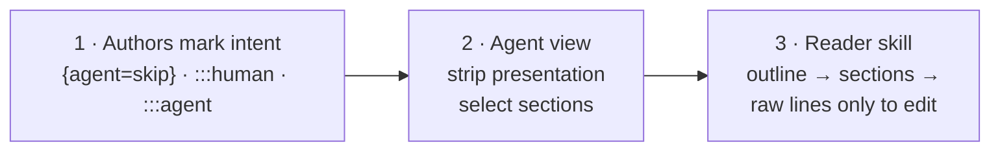

# Agent skills: import guide

Styled Markdown ships two **agent skills**: folders of instructions, references, templates and a bundled tool that an AI agent loads when a task needs them.

| Skill | The agent learns to… | Contents |
|---|---|---|
| **`styled-markdown-writer`** | **Create and edit `.smd` that follows the rules.** It picks the right template, uses only valid blocks and values, validates and auto-fixes, and writes documents that are cheap for other agents to read. | `SKILL.md`, `references/syntax.md` (complete syntax), `references/style-guide.md` (authoring rules), `assets/templates/*.smd` (13 templates), `scripts/smd.cjs` |
| **`styled-markdown-reader`** | **Read `.smd` with minimal tokens**, focusing only on meaningful content: outline first, then only the relevant sections through the agent view, and raw lines only when editing. | `SKILL.md`, `scripts/smd.cjs` |

`scripts/smd.cjs` is the complete `smd` CLI in one file (Node.js 18+, no `npm install`).

## Contents

- [Claude Code](#claude-code)
- [Claude.ai and the Claude desktop app](#claudeai-and-the-claude-desktop-app)
- [Claude API and Claude Agent SDK](#claude-api-and-claude-agent-sdk)
- [GitHub Copilot, Cursor, Codex, Windsurf and other agents](#github-copilot-cursor-codex-windsurf-and-other-agents)
- [Verify the skills work](#verify-the-skills-work)
- [How token reduction works](#how-token-reduction-works)
- [Writing documents that stay cheap to read](#writing-documents-that-stay-cheap-to-read)
- [Update or remove](#update-or-remove)

---

## Claude Code

Claude Code discovers skills in two places:

| Scope | Folder | Use when |
|---|---|---|
| **Project** | `<repo>/.claude/skills/` | Everyone who works in the repository should get the skills. Commit the folder. |
| **Personal** | `~/.claude/skills/` | You want the skills in every project on your machine. |

### Option 1 — install with the CLI (recommended)

```bash
# Get the CLI (a single file, pinned to the release)
curl -sLo smd.cjs https://raw.githubusercontent.com/bislink360/styled-markdown/v1.1.0/skills/styled-markdown-reader/scripts/smd.cjs

# Personal: all your projects
node smd.cjs skills install --global

# Project: run from your repository root, then commit .claude/skills/
node smd.cjs skills install
```

From a clone of this repository, use the bundled copy instead: `node skills/styled-markdown-reader/scripts/smd.cjs skills install --global`.

Output:

```text
Installed styled-markdown-reader  → …/.claude/skills/styled-markdown-reader  (read .smd token-efficiently …)
Installed styled-markdown-writer  → …/.claude/skills/styled-markdown-writer  (create and edit .smd following the rules …)
```

Options:
- `--only reader` or `--only writer` installs a single skill.
- `--dir <path>` installs into any folder.

### Option 2 — copy the folders

Copy `skills/styled-markdown-reader/` and `skills/styled-markdown-writer/` from this repository into `.claude/skills/` (project) or `~/.claude/skills/` (personal). Each folder is self-contained.

### Option 3 — download from the release

Download `styled-markdown-reader.zip` and `styled-markdown-writer.zip` from the [latest release](https://github.com/bislink360/styled-markdown/releases/latest) and unzip them into a skills folder.

Start a new Claude Code session after installing. Skills load automatically when a task matches their description; you don't need to mention them.

## Claude.ai and the Claude desktop app

1. Download **`styled-markdown-writer.zip`** and **`styled-markdown-reader.zip`** from the [latest release](https://github.com/bislink360/styled-markdown/releases/latest). Each zip contains one skill folder.
2. In Claude, open **Settings → Capabilities** and make sure **code execution** is enabled; the skills run their bundled Node.js tool.
3. Under **Skills**, choose **Upload skill** and upload each zip.
4. Start a new chat and attach or paste a `.smd` document, or ask Claude to write one.

> If your plan or workspace doesn't show skill uploads, an administrator may need to enable skills for the organization. If code execution isn't available, the writer skill's rules and templates still guide authoring, but the reader can't produce agent views.

## Claude API and Claude Agent SDK

- **Claude Agent SDK:** place the skill folders in `.claude/skills/` of the project the agent runs in (use `smd skills install --dir <project>/.claude/skills`), and enable project settings and the Skill tool in your agent options as described in the Agent SDK documentation on skills.
- **Claude API (Skills):** upload the zips as custom skills and attach them to requests that use the code execution tool. Follow the current Anthropic documentation for the Skills API, since request fields and beta headers may change.

The skills need a sandbox with Node.js 18+ for `scripts/smd.cjs`.

## GitHub Copilot, Cursor, Codex, Windsurf and other agents

Agents without skill support follow the same workflow through their instruction files.

### Option 1 — install with the CLI (recommended)

Run this from your repository root (get `smd.cjs` as in [Claude Code](#claude-code)), then commit the files it writes:

```bash
node smd.cjs skills install --target cursor,copilot,agents
```

| `--target` | Writes | Loaded by the agent |
|---|---|---|
| `cursor` | `.cursor/rules/styled-markdown.mdc` | When a `.smd` file is in context (`globs: **/*.smd`) |
| `copilot` | `.github/instructions/styled-markdown.instructions.md` | When Copilot works on a `.smd` file (`applyTo: "**/*.smd"`) |
| `agents` | A section in `AGENTS.md` between `<!-- styled-markdown:start -->` and `<!-- styled-markdown:end -->` | Always, by OpenAI Codex and other agents that read `AGENTS.md` |
| `claude` | The Claude Code skills (the default) | See [Claude Code](#claude-code) |

Pick any combination: repeat `--target` or separate targets with commas. Each run also copies the CLI to `.smd/smd.cjs`, and the rules tell the agent to run `node .smd/smd.cjs outline <file>` and so on, so the agent needs Node.js 18+ and nothing else.

Output:

```text
Installed smd CLI → …/.smd/smd.cjs  (agents run it as: node .smd/smd.cjs)
Created …/.cursor/rules/styled-markdown.mdc  (Cursor rule for **/*.smd)
Created …/.github/instructions/styled-markdown.instructions.md  (Copilot instructions for **/*.smd)
Updated …/AGENTS.md  (styled-markdown section)
```

Notes:
- `AGENTS.md` is created if it's missing. If it exists, only the styled-markdown section is added or replaced; the rest of the file is kept, and re-running never adds a second section.
- The rule file, the instructions file and the section all have the same content, a short version of [docs/AGENTS.md](AGENTS.md).
- `--dir <project>` writes into another project root. `--global` and `--only` apply to the Claude skills only, and `--dir` means the skills folder for `claude`, so install `claude` and the other targets in separate runs when you use `--dir`.

### Option 2 — add the guide by hand

For other agents, or to customize the text:

1. Make the CLI available in the repository, for example by committing `.smd/smd.cjs` (copied from `skills/styled-markdown-reader/scripts/smd.cjs`) or installing it with `npm link`.
2. Add the one-page guide [docs/AGENTS.md](AGENTS.md) to the agent's instructions, either by copying it or by referencing it:

   | Agent | Instruction file |
   |---|---|
   | GitHub Copilot | `.github/copilot-instructions.md` or `.github/instructions/*.instructions.md` |
   | Cursor | `.cursor/rules/*.mdc` |
   | OpenAI Codex, and most agents | `AGENTS.md` at the repository root |
   | Windsurf | `.windsurfrules` |
   | Gemini CLI | `GEMINI.md` |

   A minimal snippet:

   ```markdown
   ## Styled Markdown (.smd)
   Project docs use Styled Markdown. Follow docs/AGENTS.md.
   - Reading: run `node .smd/smd.cjs outline <file>`, then `node .smd/smd.cjs agent <file> --section "<heading>"`.
     Don't read .smd files whole.
   - Writing: start from `node .smd/smd.cjs init <file> --template prd|adr|rfc|runbook|api|status-report|meeting-notes|postmortem|release-notes|okrs|onboarding|test-plan|pr-description`,
     then run `node .smd/smd.cjs validate <file> --fix` until there are 0 errors.
   ```

Agents that support the Model Context Protocol (Cursor, VS Code, Claude Desktop, Claude Code) can instead register the MCP server, `smd mcp`, which offers the same reading commands as tools. See [MCP server](AGENTS.md#mcp-server).

## Verify the skills work

Try these prompts in a new session in a repository that contains `.smd` files (this repository's `examples/` folder works):

| Prompt | Expected behaviour |
|---|---|
| *"What constraints apply to POST /v1/orders in examples/checkout-redesign.smd, and which @api-team tasks are open?"* | The agent runs `smd outline`, then `smd agent … --section …`. It doesn't read the raw file, and it reports the idempotency, integer-cents and 422 rules plus the two open tasks, one of them overdue. |
| *"Which decisions in the checkout spec are final and what is still open?"* | It lists the accepted and rejected decisions, the open question with its owner and deadline, and the fallback from the agent instructions. |
| *"Write an ADR for moving our cron jobs to a managed scheduler, as docs/adr-0012-scheduler.smd."* | The agent uses the `adr` template, fills every placeholder, runs `smd validate --fix`, and ends with 0 errors. |
| *"What's overdue across docs/?"* | It runs `smd tasks docs/`. |
| *"Which high-impact risks are still open, and what did we decide about payments?"* | It runs `smd query "risk[impact>=high][status!=closed], decision[title*=pay]" docs/` and reads only those blocks. |
| *"Which of our docs covers refunds, and what does it say about retries?"* | It runs `smd index docs/`, picks the document by title, summary and tags, then reads only the matching section with `smd agent … --section …`. |
| *"The spec changed since last week. What's different?"* | It runs `smd diff docs/spec.smd --since "HEAD@{1.week.ago}"` (or a commit) and reads only the changed sections. |

## How token reduction works

Three layers, each optional and each adding to the others:



1. **Author intent.** `## Background {agent=skip}` and `:::human` mark content for people only. `:::agent` holds constraints for implementers and is **always** included, even when an agent reads a single section.
2. **The agent view** (`smd agent`) keeps meaning and drops presentation:

   | In the file | What the agent reads |
   |---|---|
   | `:::warning Breaking change` … `:::` | `<warning title="Breaking change">` … `</warning>` |
   | `:::decision{status=accepted date=… owner=@maya} Title` | `<decision status="accepted" date="…" owner="@maya"> Title` |
   | `:badge[Beta]{color=amber}` · `[text]{color=red}` | `[Beta]` · `text` |
   | `- [ ] Task :priority[P1] @api :due[2026-09-25]` | `- [ ] Task [P1] @api (due 2026-09-25, OVERDUE)` |
   | `## Requirements` | `## Requirements  [L53]`, with a line ref for precise edits |
   | Tabs, columns, cards, boxes | Labels only (`Tab "npm":`) |
   | Images, HTML comments, table padding | `[image: alt]`, removed, trimmed |
   | ```` ```ts file="src/x.ts" lines="7-13" ```` | `[code: src/x.ts lines 7-13 — read that file]` |
   | `:::human`, `{agent=skip}` sections | *(omitted)* |
   | With `--brief`: diagrams, long code, details, done tasks | One-line pointers with line ranges |

3. **The reader skill** turns this into a habit: `smd outline` (≈100–300 tokens) shows every section's cost, and the agent then pulls only what it needs. For documents with `related:` links, `smd outline --related` adds each related document's summary and cost, so the agent opens one only when the question needs it.

Measured on the examples:

| Read | ≈ tokens | Saving |
|---|---:|---:|
| `checkout-redesign.smd` raw | 2,424 | — |
| outline | 230 | 90% |
| full agent view | 1,531 | 37% |
| one section (+ agent instructions) | 365–542 | 78–85% |
| `smd tasks examples/` vs. reading all 7 examples | 672 vs 7,258 | 91% |
| `smd query "decision, risk" examples/` vs. reading all 7 examples | 821 vs 7,258 | 89% |

**What to expect in practice:** in a head-to-head test on that PRD, agents with and without the reader skill both answered correctly, and total session tokens were within about 1%. On a single ~2k-token document, the skill's own cost (≈900 tokens for SKILL.md plus the outline) roughly cancels the saving. The benefit grows with **larger documents, many documents, and repeated reads**, which is why the skill tells agents to read small files in one call and select sections only when a file is big.

## Writing documents that stay cheap to read

The writer skill applies these rules automatically. Humans can follow them too:

- Write a precise one- or two-sentence `summary:` in front matter. It's the first thing every agent reads, and often the only thing it needs.
- Put background, history, research and thanks under `## … {agent=skip}` or in `:::human`.
- Put every hard rule for implementers in **one** `:::agent` block, including the fallback for open questions.
- Use `:::details` for long logs and lists, and embed code with `file="…" lines="…"` instead of pasting it.
- Name headings after their content ("Requirements", "API", "Rollout"), because agents select sections by heading.

## Update or remove

- **Update:** run `smd skills install` again, with the same `--target` values (it overwrites the files and replaces the `AGENTS.md` section), or re-copy the folders or zips from the newer release.
- **Remove:** delete the `styled-markdown-reader` and `styled-markdown-writer` folders from your skills directory, or remove them in Claude.ai under **Settings → Capabilities → Skills**. For other agents, delete `.smd/`, `.cursor/rules/styled-markdown.mdc`, `.github/instructions/styled-markdown.instructions.md` and the styled-markdown section of `AGENTS.md` (markers included).
