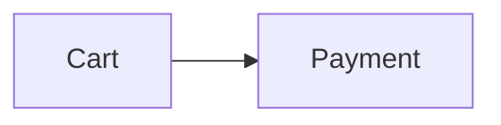

# Styled Markdown (`.smd`) — Specification v1

Styled Markdown is a **strict superset of CommonMark + GitHub-Flavored Markdown**. It adds a small, validated vocabulary for styling, layout, diagrams, math and audience-aware content, so a single file works well for developers, product managers and AI agents.

- File extension: `.smd`
- Author: Roshan Alwis
- Media type (suggested): `text/x-styled-markdown`
- Encoding: UTF-8
- Spec version: `1` (declared in front matter as `smd: 1`)

---

## 1. Design principles

| # | Principle | What it means in practice |
|---|-----------|---------------------------|
| 1 | **Superset, never fork** | Every valid `.md` file is a valid `.smd` file with identical meaning. Rename `.md` → `.smd` and nothing breaks. |
| 2 | **Readable as plain text** | The raw source must still read well in a terminal, a diff, a code review or an LLM context window. No HTML soup, no opaque IDs. |
| 3 | **Borrow proven syntax** | Containers follow the *generic directives* proposal used by remark-directive, MyST and Docusaurus; attribute lists follow Pandoc; alerts map to GitHub alerts. Nothing is invented where a convention already exists. |
| 4 | **Semantic before presentational** | Prefer `:::warning` over red text. Colors are *named tokens* (`red`, `green`, `accent`) that adapt to light/dark themes instead of hard-coded hex. |
| 5 | **Validated** | Every extension has a schema. Tools can report precise, line-level errors with stable rule codes and machine-applicable fixes. |
| 6 | **Safe** | No scripts. Style attributes are whitelisted keys with whitelisted values, so documents cannot inject CSS or JavaScript. |
| 7 | **Graceful degradation** | Every `.smd` feature has a defined plain-Markdown fallback (`smd to-md`), e.g. callouts → GitHub alerts. |
| 8 | **Agent-addressable** | Front matter gives agents a summary and status up front; `:::agent` blocks carry instructions without cluttering the human view. |

---

## 2. Document structure

```text
┌─────────────────────────────┐
│ ---                         │  Optional YAML front matter
│ smd: 1                      │  (recommended)
│ title: …                    │
│ ---                         │
├─────────────────────────────┤
│ Markdown body               │  CommonMark + GFM
│   + containers  :::name     │  + Styled Markdown extensions
│   + inline      :name[…]{…} │
│   + spans       […]{…}      │
└─────────────────────────────┘
```

### 2.1 Front matter

A YAML mapping between `---` lines at the very start of the file. It is parsed with the YAML *core* schema, so `2026-09-26` stays a string.

| Key | Type | Meaning |
|-----|------|---------|
| `smd` | number | Spec version. **Recommended.** Currently `1`. |
| `title` | string | Document title. Rendered as the page heading — don't repeat it as `# H1`. |
| `summary` | string | 1–2 sentences. Agents should read this first. Inline Markdown allowed. |
| `status` | enum | `draft` · `review` · `approved` · `deprecated` · `archived` |
| `owners` | list | People or teams, e.g. `["@alice", "@platform"]` |
| `audience` | enum | `humans` · `agents` · `both` |
| `tags` | list | Free-form tags |
| `version` | string/number | Document version |
| `created`, `updated` | date | `YYYY-MM-DD` |
| `theme` | enum | Rendering hint: `auto` · `light` · `dark` |
| `accent` | color | Accent color for headings, links, badges (see §5) |
| `toc` | boolean | `true` renders a table of contents after the header |
| `related` | list | Paths or URLs of related documents |
| `lang` | string | Language of the labels the renderer adds (callout titles, "Figure 2", "overdue"…), a BCP 47 tag such as `de` or `pt-BR`; see §2.2. Default English |

Unknown keys are allowed and preserved (reported as *hints* so typos are caught, except keys the body shows with `{{key}}`).

Any key, standard or custom, can be shown in the text with `{{key}}` (§4.7).

The table is published as a JSON Schema: [`extension/schemas/smd-frontmatter.schema.json`](https://raw.githubusercontent.com/bislink360/styled-markdown/main/extension/schemas/smd-frontmatter.schema.json), also shipped on npm as `styled-markdown/frontmatter.schema.json`. The validator and editor completion read the same schema, and YAML tools or pipelines can use it to check document metadata.

A document is **stale** when `updated` is more than 180 days before today (tools may make this configurable) and `status` is not `archived` or `deprecated`.

### 2.2 Localization

The renderer adds a few words of its own around a document's text: callout titles (`Note`, `Warning`), "Figure 2", "overdue", the hidden "Footnotes" heading, header labels such as "Owners" and "Updated", status names, the risk matrix headers and the static site's navigation. `lang` in the front matter picks their language:

```yaml
lang: de        # Hinweis, Abbildung 2, überfällig, Fußnoten …
```

- **Value**: a BCP 47 language tag. It is matched by lookup, dropping subtags from the end: `pt-BR` uses `pt`, `zh-Hant-TW` uses `zh`. Case does not matter, and `_` reads as `-`.
- **Languages with labels**: `en` (the default), `de`, `es`, `fr`, `ja`, `pt`, `zh`. A label a language lacks is shown in English.
- **Other languages**: an unsupported or malformed `lang` renders English labels; `smd validate` reports it as `frontmatter/lang` (info, never an error) with the supported list. A well-formed tag is still put on the page, so a `lang: ko` document is marked as Korean for screen readers and browsers.
- **What changes**: rendered HTML only. The article gets `lang="…"` (and the page `<html lang="…">`) and the labels the page script shows (copy buttons, diagram messages) travel with it in `data-smd-labels`. Values the author wrote are translated only where they are vocabulary: `status: draft`, `:priority[high]`, `impact=high`, `color=green` with no text. Dates, numbers, titles and all other text stay as written.
- **What does not change**: agent views, `smd outline`, `smd to-md` (including its "Figure 2" labels), validator messages and JSON outputs stay English. They are read by agents and tools, for which stable, compact output matters more than the reader's language.
- **English**: a document without `lang`, or with `lang: en` (or any `en-…` tag), renders exactly as it did before `lang` existed.
- **Fallback**: renderers may take a language for documents that don't name one: `renderSmd(text, { lang })`, the markdown-it plugin's `lang` option or a render's `env.lang`, and `--lang` on `smd render`, `smd pdf` and `smd build`. The document's own `lang` always wins. `smd build` labels its navigation, search and dashboard in `--lang`, else the home document's `lang`, else English.

---

## 3. Block containers

```text
:::name{attributes} Optional title
Any Markdown content, including other containers.
:::
```

- An opening fence is **three or more colons**, then a name (`[a-zA-Z][\w-]*`), then an optional attribute list `{…}` directly after the name, then an optional title.
- A closing fence is a line with **three or more colons and nothing else**.
- **Nesting**: a closing fence always closes the *innermost* open container. Colon count is cosmetic — authors may use more colons on outer containers (`::::tabs`) for readability, but it's not required.
- Fenced code blocks inside a container are opaque; a `:::` inside a code block never closes the container.
- An unclosed container extends to the end of its parent (and is a validation error).
- Titles support inline Markdown.

### 3.1 Container vocabulary

| Name | Purpose | Extra attributes |
|------|---------|------------------|
| `note` `info` `tip` `success` `warning` `danger` `question` | Callouts | `title`, `collapsible` (value `open` starts expanded) |
| `details` | Collapsible section; title = summary | `title`, `open` |
| `card` | Bordered card with accent stripe | `title`, `accent` |
| `box` | Generic block for style attributes | — |
| `tabs` → `tab` | Tab group; each `tab` title is its label | `title` (on `tab`) |
| `columns` → `column` | Side-by-side layout (stacks on narrow screens) | `width` (`30%` or ratio `2`) |
| `steps` | Renders the ordered list inside as numbered steps | — |
| `agent` | Content addressed to AI agents (instructions, constraints) | `title`, `priority` |
| `human` | Content addressed to human readers only | `title` |

| `decision` | Decision record (ADR-style); title = the decision | `status` (`proposed` `accepted` `rejected` `superseded` `deprecated`), `date`, `owner` |
| `risk` | Risk with mitigation in the body | `impact`, `likelihood` (`low` `medium` `high` `critical`), `owner`, `status` (`open` `mitigated` `accepted` `closed`) |
| `risk-matrix` | Impact × likelihood matrix of the document's `risk` blocks (closed ones left out); cells coloured by score, risks with an `{#id}` linked. Write it with an empty body; a body renders below the matrix as a caption | `title` (or title text after the name) |
| `api` | API endpoint; body documents params/responses | **`method`** (`GET` `POST` `PUT` `PATCH` `DELETE` `HEAD` `OPTIONS` `WS` `RPC` `EVENT`), **`path`**, `auth` |
| `timeline` | Renders the list inside as a vertical timeline (tasks inside show done state) | — |
| `figure` | Numbered figure around an image, diagram, table or code block; title = the caption (§3.3) | `title`, `kind` (`figure` `table` `listing`) |
| `include` | Transclusion: another document's body, or one section of it, in place of the block (§3.4). The body is fallback text | `file` (needed), `section`, `level` (`1`–`6`) |
| `glossary` | Glossary: a `**Term**: definition` list, rendered as a definition list; the first use of each term per section shows its definition (§3.5) | `title` (or title text after the name) |
| `changelog` | Release history: each heading directly inside is a release, `## 1.2.0 — 2026-03-01`, newest first, followed by its notes; rendered as a timeline (§3.6) | `title` (or title text after the name) |
| `quote` | Quotation; the body is the quoted text, rendered with a `— Author, Source` line (§3.7) | `author` (recommended), `source`, `cite` (an `http(s)` or relative URL) |

All containers additionally accept the style attributes in §5. Attributes in **bold** are required.
`tab` must be a direct child of `tabs`; `column` of `columns`.
Unknown container names render as a plain `box` and produce a warning.
A `risk` without `impact` has impact `medium`. Risk registers (`smd risks`, `:::risk-matrix`) score a risk as impact × likelihood, each ranked `low` 1, `medium` 2, `high` 3, `critical` 4; a missing or unknown likelihood also counts as `medium`, and a missing `status` means `open`.

### 3.2 Audience semantics

- **`:::agent`** — Agents MUST treat the content as instructions/constraints relevant to the document. Human-facing renderers SHOULD show it collapsed (configurable: collapsed / expanded / hidden).
- **`:::human`** — Agents MAY skip this content when extracting instructions; it's context for people.
- Everything else is for both audiences.

### 3.3 Figures and numbered references

````text
The flow is in :ref[fig-checkout].

:::figure{#fig-checkout} Checkout flow

:::
````

- **Content:** a `figure` wraps the thing it captions: usually one image, Mermaid diagram, table or code block. Any Markdown is allowed.
- **Caption:** the title (text after the name, or `title="…"`). Inline Markdown is allowed. A figure without a caption is still numbered.
- **Numbering:** figures are numbered in document order, nested ones included, with one counter per `kind`: `figure` (the default; an unknown value also counts as `figure`) is labelled *Figure n*, `table` *Table n*, `listing` *Listing n*. Numbers are computed, never written, so they stay right when figures move.
- **Rendering:** `<figure id="…" class="smd-figure smd-figure-{kind}">`, the content, then `<figcaption class="smd-figure-caption"><span class="smd-figure-label">Figure 1:</span> Caption</figcaption>`. The stylesheet shows a table's caption above it.
- **References:** the inline directive `:ref[id]` (§4.2) stands for the label of the figure with that `{#id}`, e.g. *Figure 2*, linked to it: `<a class="smd-ref" href="#id">Figure 2</a>`. It may come before the figure and may appear in titles. An id that names no figure renders as written, marked `smd-ref-missing`, and is a `figure/unknown-ref` warning. When two figures share an id, references go to the first (`figure/duplicate-id`).

Why a directive and not a link: an empty-text link `[](#fig-checkout)` would be invisible in every renderer that doesn't know figures (GitHub, older `.smd` tools), and `[@fig-checkout]` could already appear in documents as plain text (a bracketed mention). `:ref[…]` follows the existing directive rules (a `:` after whitespace or opening punctuation), so no existing text changes meaning, and an older renderer shows it as the readable text `:ref[fig-checkout]`.

**Older renderers** (1.5 and earlier) treat `:::figure` as an unknown container: the content renders inside a plain box (`<div id="…" class="smd-box smd-box-figure">`) without the caption, the validator reports `container/unknown` (a warning) and the agent view and `smd to-md` keep the content only. `:ref[id]` stays literal text, with no diagnostic.

### 3.4 Includes (transclusion)

```text
:::include{file="shared/terms.smd" section="Pricing" level=3}
See [Pricing](shared/terms.smd#pricing) in the shared terms.
:::
```

- **`file`** is a path relative to the including document. The included document's body is used, without its front matter.
- **`section`** picks one section: the heading whose id (`#pricing` or `pricing`) or text matches, as `smd agent --section` matches them (an exact id wins over text that only contains the words), with everything up to the next heading of the same or a higher level, subsections included.
- **`level=N`** moves the included headings so the top one (the section heading, or the document's highest heading) becomes level N; the others keep their distance from it (capped at 6). Without it, headings keep the levels they have in their own file. Use it to nest the included text under the current heading.
- The block is closed with `:::` like every container. Its **body is fallback text**: renderers that include ignore it, and show it (under a short note with a link to the file) only when the file can't be included. A link to the file is a good body: renderers older than 1.6, which don't know `include`, show it as a plain box.
- The included text is parsed with the same rules as the document, so nested includes and every block (and markdown-it plugins the host adds) work. Paths inside it (nested includes, links, images, code embeds) stay relative to the included file. Its tasks can't be checked off from the including document.
- **Heading ids.** The including document's own headings keep exactly the ids they have without the include. Included headings keep the ids they have in their own file, numbered (`pricing-1`) where the including document already uses them; links inside the included text follow the renamed ids. Links in the including document may point at included headings by their ids.
- **Files are read only through the host's sandboxed reader**, the same one that reads code embeds (§6): the CLI reads inside the working directory, the document's folder and its Git repository; VS Code inside the workspace folders and the document's folder; the MCP server inside its root. A host without a reader (and the markdown-it plugin without `readFile`) includes nothing and shows the fallback with an "Include not available here" note.
- **Limits.** An include chain that leads back to a document being included (`a.smd → b.smd → a.smd`, or a document that includes itself) stops there with a note instead of repeating. Includes nest at most 8 deep, and one document includes at most 200 times and 2,000,000 characters.
- **What includes, what doesn't.** Rendered output (preview, HTML, PDF, `smd build`), the agent view (§8a) and `smd to-md` (§8) include. `smd outline` lists the including document's own headings and line ranges, and an include adds to the token cost of the section it is in, as `smd agent --section` would show it. `smd query`, `smd tasks`, `smd decisions`, `smd risks`, `smd index` and `smd diff` read each document as written, an include being a one-line pointer there; the included document is read on its own.
- **Figures (§3.3) in included text** are numbered with the including document's figures in rendered output, and `:ref[id]` there can name them; `smd validate` accepts such references when it can read the include. The agent view and `smd to-md` number an included document's figures within that document, and leave a `:ref` from the including document to one of them as written (`:ref[fig-b]`; the `<figure id="fig-b">` is in the `<included>` block).

### 3.5 Glossaries and defined terms

```text
Every API call counts against the SLO; the error budget is what is left.

:::glossary Glossary
- **API**: Application Programming Interface
- **SLO**: Service level objective
- **Error budget**: How much unreliability the SLO allows in a period.
:::
```

- **Entries:** the bullet list directly inside a `glossary` holds its entries. Each item starts with a bold term and a colon, `**Term**: definition` (or `**Term:** definition`); the rest of the item is the definition, and may have inline Markdown, more paragraphs and nested lists. A list renders as a glossary only when every item is an entry; otherwise it stays a plain list and defines nothing (`glossary/entry`). Other content in the block, such as an introduction, renders as usual. A document may have several glossaries; they share one set of terms.
- **Rendering:** `<div class="smd-glossary">`, the title if any (`<div class="smd-glossary-title">`), then `<dl class="smd-glossary-list">` with `<dt id="term-{slug}"><dfn>Term</dfn></dt><dd>definition</dd>` for each entry. When a term is defined twice, the first definition wins and only its `<dt>` has the id (`glossary/duplicate`).
- **Uses:** elsewhere in the document, the first use of each term in each section (the text between two headings of any level) links to its definition, with the definition's plain text as a tooltip: `<a class="smd-term" href="#term-api"><abbr title="Application Programming Interface">API</abbr></a>` for an abbreviation, `<a class="smd-term" href="#term-error-budget" title="How much …">error budget</a>` for any other term. Later uses in the same section stay plain text.
- **Matching:** a use is a whole word: no letter, digit or `_` on either side, no `.` `/` `@` `#` `-` just before it and no `.` `/` `@` `-` followed by a letter or digit just after it, so `API.md`, `/api`, `#API` and `API-first` are not uses. An *abbreviation* (a term with capital letters and no lower-case ones: `API`, `SLO`, `P99`) matches only as written. Any other term matches as written or with the case of its first letter changed (`Error budget`, `error budget`), not otherwise (`ERROR BUDGET`). Longer terms win (`API gateway` over `API`). Other word forms (plurals) are not uses.
- **Never changed:** headings (so heading ids and the table of contents stay the same), container titles, glossaries themselves, code spans and blocks, math, links and their text (raw `<a>` links too), autolinks and URLs, raw HTML blocks and tags, image alt text, attribute lists and inline directives. Footnote references and footnote definitions (§4.6) are never marked either.
- **Includes (§3.4):** included text is part of the rendered document. A glossary in an included file defines terms for the whole document (so a shared glossary can be included), and the document's terms are marked in included text, under the same first-use-per-section rule. `smd validate` counts uses in included text when it can read the include, so a term used only there is not `glossary/unused`; editor hovers know the document's own glossaries.
- **Accessibility:** a definition is never available only on hover. Each marked use is a link to its `<dt>`, which keyboard and screen-reader users can follow (rendered pages move focus to it), and the expansion of an abbreviation is its `<abbr title>`.

Why the first use in each section: style guides expand an abbreviation at its first use, marking every use fills paragraphs with underlines, and a reader who jumps to a section from the contents or a link still finds the term marked there. Why a block and not front matter: a glossary is content people read and print, it is a readable list in GitHub and older tools, and agents read it once in the agent view.

**Older renderers** (1.5 and earlier) treat `:::glossary` as an unknown container: the list renders as a normal bulleted list inside a plain box (`<div class="smd-box smd-box-glossary">`), uses of the terms stay plain text, and the validator reports `container/unknown` (a warning). See §10.

### 3.6 Changelogs (release history)

```text
:::changelog Release history
## 1.2.0 — 2026-03-01
- Added CSV export

## [1.1.0] - 2026-01-15
### Fixed
- Date picker in Safari

## Unreleased
:::
```

- **Entries:** the ATX headings directly inside a `changelog` (not inside a nested container, list or blockquote) at the highest level used there are its releases; deeper headings (`### Fixed`) are sections of the release above them. Content before the first release (an introduction) stays above the list. Releases are written **newest first**, and render in the order written.
- **Entry heading:** the version, then a separator (` — `, ` – `, ` - `, ` -- ` or ` --- `, with spaces around it), then the date as `YYYY-MM-DD`. The date is the text after the last separator; `v1.2.0 (2026-03-01)` is also read as a date. A heading without one is a version without a date (`## Unreleased`). The version is any inline Markdown, so Keep a Changelog's `## [1.2.0] - 2026-03-01` (a link when `[1.2.0]: …` is defined) works as written. For ordering, the version number is the first `1.2.0`-like number in it (a leading `v` ignored), compared as a semantic version: part by part, a pre-release (`1.2.0-beta.1`) before its release.
- **Rendering:** `<div class="smd-changelog">`, the title if any (`<div class="smd-changelog-title">`), the introduction, then `<ol class="smd-changelog-list">` with one `<li class="smd-changelog-entry">` per release holding its heading and notes. In the heading, the version is wrapped in `<span class="smd-changelog-version">` and a valid date in `<time class="smd-changelog-date" datetime="2026-03-01">`; a date that isn't one is `<span class="smd-changelog-date smd-changelog-date-invalid">`. The heading's text is not changed, only wrapped.
- **Headings stay headings:** release headings keep the ids, `{#id}` attributes and outline entries that the same heading has outside the block (and in 1.5), so `smd outline`, `--section`, the table of contents and links to them behave as for any heading.
- **Validation (warnings):** `changelog/date` for a date that is not a real `YYYY-MM-DD` date (fix for year-first dates such as `2026/3/1`), `changelog/order` for a version newer than the one listed above it, `changelog/duplicate` for a version listed twice (the same number, or the same text for entries without one).

Why headings and not `:::release{version=… date=…}` children: the version and date stay visible text in GitHub, in 1.5 renderers and in any Markdown tool, release notes copied from a `CHANGELOG.md` work unchanged, and there is no nested block syntax to get wrong.

**Older renderers** (1.5 and earlier) treat `:::changelog` as an unknown container: the headings and lists render as usual inside a plain box (`<div class="smd-box smd-box-changelog">`) with the same heading ids, and the validator reports `container/unknown` (a warning). See §10.

### 3.7 Quotes with attribution

```text
:::quote{author="Ada Lovelace" source="Notes" cite="https://example.com/notes"}
The quoted text, any Markdown.
:::
```

- **Body:** the quotation. **`author`** is who said or wrote it, **`source`** where (a book, talk or page), **`cite`** the URL of the source. `author` and `source` may contain inline Markdown.
- **Rendering:** `<figure class="smd-quote"><blockquote cite="…">` the body `</blockquote><figcaption class="smd-quote-caption">— <span class="smd-quote-author">Author</span>, <cite>Source</cite></figcaption></figure>`. When `cite` is given, `source` links to it. Without `author` and `source` there is no caption.
- **`cite`** must be an `http:` or `https:` URL or a relative one (no scheme, not `//host`, no spaces); it then goes through the same checks and normalization as link targets. Any other value (`javascript:`, `data:`, `mailto:`…) is left out of the output and reported as `quote/cite`.
- **Not a figure:** quotes use the `<figure>` element but are never numbered with `:::figure` (§3.3) and are not `:ref` targets. A quote inside a `:::figure` is part of that figure's content.
- **Validation (warnings):** `quote/empty` for a quote without text, `quote/author` for one without `author`, `quote/cite` for a `cite` that is left out.

**Older renderers** (1.5 and earlier) treat `:::quote` as an unknown container: the text renders inside a plain box (`<div class="smd-box smd-box-quote">`) without the attribution, and the validator reports `container/unknown` (a warning). See §10.

---

## 4. Inline syntax

### 4.1 Styled spans

```text
[text]{attributes}
```

A bracketed span immediately followed by an attribute list. Only style attributes (§5) are allowed. Content may contain other inline Markdown. Links (`[text](url)`) and images are unaffected because a styled span requires `{` directly after `]`.

### 4.2 Inline directives

```text
:name[content]{attributes}
```

The `:` must be at the start of a line or preceded by whitespace or opening punctuation, so `10:30` and `note:[x]` are never directives.

| Directive | Content | Attributes | Example |
|-----------|---------|------------|---------|
| `badge` | required | `color` | `:badge[Shipped]{color=green}` |
| `status` | required | `color` | `:status[At risk]{color=red}` |
| `kbd` | required (`+` separates keys) | — | `:kbd[Ctrl+Shift+P]` |
| `mention` | required | — | `:mention[@platform]` |
| `progress` | — | `value` (0–100), `color`, `label` | `:progress{value=60}` |
| `priority` | required: `P0`–`P4` or `critical` `high` `medium` `low` | — | `:priority[P1]` |
| `due` | required: `YYYY-MM-DD` | — | `:due[2026-10-15]` (overdue = red, ≤ 7 days = amber) |
| `metric` | required: the value | `label` (recommended), `delta`, `trend` (`up` `down` `flat`), `good` (`up` `down`) | `:metric[42%]{label="Activation" delta="+3%" trend=up}` |
| `ref` | required: the id of a `figure` | — | `:ref[fig-checkout]` → *Figure 2*, linked (§3.3) |

### 4.2.1 Task metadata

A task item may carry an owner (`@name` or `:mention[…]`), `:priority[…]` and `:due[…]`. Tools extract these (`smd tasks`, `smd meta`), and open tasks past their due date produce a `task/overdue` info diagnostic.

```text
- [ ] Idempotent order creation :priority[P0] @api-team :due[2026-10-03]
```

### 4.2.2 Heading attributes

A heading may end with an attribute list: `## Title {#custom-id .class agent=skip}`.

- `#id` sets the anchor id.
- `agent=skip` marks the section (up to the next heading of the same or higher level) as **human-only**. Agent views omit it, and the preview shows a "humans only" tag.

### 4.3 Highlight

`==text==` renders highlighted text (`<mark>`).

### 4.4 Math

- Inline: `$E = mc^2$` — no whitespace just inside the `$`, and the closing `$` must not be followed by a digit (so `$5 and $10` is plain text).
- Display: a `$$ … $$` block, or a fenced block with language `math`.
- Syntax: LaTeX as supported by KaTeX.

### 4.5 Task lists

GFM task lists (`- [ ]`, `- [x]`). Renderers connected to an editor MAY make them toggleable.

### 4.6 Footnotes

GitHub-compatible (GFM) footnotes, since 1.6:

```markdown
Retries are capped at five[^retries], as the SRE review asked[^SRE].

[^retries]: Five covers 99.9% of transient failures in last quarter's logs.
[^sre]: SRE review, 2026-09-12.
    Lines indented by 4 spaces continue the footnote.

    So do further paragraphs, lists and code, indented the same way.
```

- **Reference:** `[^label]`. The label is a number or a word without spaces or tabs and matches its definition case-insensitively (`[^SRE]` uses `[^sre]:`).
- **Definition:** `[^label]: text` at the start of a line (up to 3 spaces of indent), anywhere in the document, including inside containers and lists. Lines indented by 4 spaces continue it, so a footnote can hold several paragraphs, lists or code.
- **Rendering:** footnotes are numbered by their first reference, whatever the labels and the order of the definitions, and collected in a footnotes section at the end of the document, each with a back link (↩) to every reference. Unreferenced definitions are not shown, the first definition of a repeated label wins, and a reference to an undefined label stays literal text — all as on GitHub. References inside link text stay text, and `[^x](url)` remains a link.
- **HTML:** GitHub's structure, with `smd-` classes added and ids without GitHub's `user-content-` prefix:

  ```html
  <p>…capped at five<sup class="smd-footnote-ref"><a href="#fn-1" id="fnref-1" data-footnote-ref role="doc-noteref" aria-describedby="footnote-label">1</a></sup>…</p>
  <section class="footnotes smd-footnotes" data-footnotes>
  <h2 id="footnote-label" class="smd-sr-only">Footnotes</h2>
  <ol>
  <li id="fn-1">
  <p>Five covers… <a href="#fnref-1" class="smd-footnote-backref" data-footnote-backref role="doc-backlink" aria-label="Back to reference 1">↩︎</a></p>
  </li>
  </ol>
  </section>
  ```

  Ids use the footnote's number: `fn-1`, `fnref-1`, and `fnref-1-2` for the second reference to the same footnote, whose back link reads `↩︎²` ("Back to reference 1-2"). The "Footnotes" heading is visually hidden; it labels the references for screen readers. Heading ids and outlines are unchanged: a reference in a heading counts as its text as written, as it did before 1.6.
- **Older renderers** (Styled Markdown before 1.6, and Markdown renderers without footnotes) show the syntax as written: `[^1]` stays text and a definition is a plain paragraph — except a definition whose text is a single word, such as `[^1]: Note`, which CommonMark reads as a link reference definition, so `[^1]` then renders as a link labelled `^1` pointing at `Note`. Write definitions as sentences to keep that degradation readable. Conversely, a document that used `[^label]: url` as a link reference definition now gets a footnote; GitHub reads it the same way.

### 4.7 Front matter variables

```text
---
smd: 1
title: Release notes
version: "2.10"
release:
  date: 2026-10-20
owners: ["@platform", "@docs"]
---

## What's new in {{version}}

Version {{version}} ships on {{release.date}}. Questions: {{owners}}.
```

renders *What's new in 2.10* and *Version 2.10 ships on 2026-10-20. Questions: @platform, @docs.* (since 1.6)

- **Syntax:** `{{name}}`, with optional spaces inside the braces (`{{ version }}`). A name is a front matter key: letters, digits, `_` and `-`, starting with a letter or `_`. Dots reach into nested mappings (`{{release.date}}`) and lists (`{{owners.0}}`); a key that itself contains the dots wins over the nested path.
- **Values:** strings, numbers and booleans as YAML reads them, and lists of those joined with `, `. A string on several lines becomes one line. The value is **text**: Markdown and HTML in it are shown as written, never rendered (HTML is escaped). YAML reads `version: 2.10` as the number 2.1, so quote version numbers: `version: "2.10"`.
- **Only defined names are replaced.** `{{name}}` for a key the front matter doesn't have, or whose value is a mapping or empty, stays exactly as written, so documents that show Handlebars, Jinja or Mustache syntax in prose render as before. The validator reports them (§7): `variable/undefined` as info, with the closest key as a fix, and `variable/not-text` as a warning.
- **Escaping:** `\{{name}}` shows `{{name}}` (the backslash escapes the brace, as for any Markdown punctuation), and so does a code span. `{{{name}}}` (Handlebars' triple braces) is never a variable.
- **Where values are shown:** text in paragraphs, headings, lists, tables, block quotes and footnotes, link text, image alt text, container titles (`:::note Upgrading to {{version}}`, also `title="…"`) and inline directive content (`:badge[v{{version}}]`, `:due[{{release.date}}]`; there the value becomes part of the content, so `:due` checks the date it names).
- **Order:** values are put in while inline Markdown is parsed, before anything that works on the resulting text: a glossary term (§3.5) inside a value is marked like any other use, task labels and heading text include the value, and the typographer treats it as text.
- **Never replaced:** code spans, fenced and indented code, math, Mermaid, raw HTML (tags, attribute values and HTML blocks) and comments, link and image destinations and reference definitions (URLs keep `{{…}}`; renderers percent-encode the braces), attribute lists other than a container's title, and the front matter itself: the header shows `title` and `summary` as written.
- **Heading ids** come from the heading as written: `## What's new in {{version}}` has the id `whats-new-in-version` whatever the value, so links don't break when the value changes. The heading text (table of contents, outline, `smd agent --section`, `smd tasks` sections) shows the value.
- **Includes:** text included with `:::include` (§3.4) uses the *including* document's front matter, since the included body comes without its own.
- **Tools:** rendered output, the agent view (§8a), `smd to-md` (§8), `smd tasks` and `smd query` (task text, due dates and block titles), `smd meta` and the editors' outlines show the values; `smd fmt` leaves `{{name}}` as written. In the markdown-it plugin the `variables` option (default on) turns them off; the plugin reads the front matter from the source, and a host that removes the front matter first can pass its data as `env.smdVariables`.

---

## 5. Attributes

```text
{key=value key2="quoted value" .class #id flag}
```

- Values may be bare, `"double-quoted"` or `'single-quoted'`.
- `.class` adds a utility class (rendered as `smd-u-<class>`); `#id` sets the element id.
- A bare `flag` means `flag=true`.

### 5.1 Style attributes

| Key | Values |
|-----|--------|
| `color` | named color · `#hex` · `rgb()/rgba()/hsl()/hsla()` |
| `bg` | same as `color` (named colors become a soft tint) |
| `border` | same as `color` |
| `size` | `xs` `sm` `md` `lg` `xl` `2xl` |
| `weight` | `normal` `medium` `bold` |
| `font` | `sans` `serif` `mono` |
| `align` | `left` `center` `right` (blocks) |
| `style` | `italic` `underline` `strike` (space- or comma-separated) |

### 5.2 Named colors

`red` `orange` `amber` `yellow` `green` `teal` `cyan` `blue` `indigo` `purple` `pink` `gray` `muted` `accent`

Named colors are theme tokens: renderers choose values with adequate contrast for light and dark backgrounds (WCAG 2.2 AA: at least 4.5:1 for text, 3:1 for graphics such as status dots), and SHOULD NOT convey meaning by color alone. `accent` follows the document's `accent` front matter. **Prefer named colors**; use hex only for brand colors.

Any value outside these lists is a validation error and is dropped by the renderer.

---

## 6. Fenced code blocks

| Info string | Behaviour |
|-------------|-----------|
| `mermaid` | Rendered as a Mermaid diagram. The first non-comment line must be a Mermaid diagram type (`flowchart`, `sequenceDiagram`, `gantt`, `pie`, `erDiagram`, `stateDiagram-v2`, `classDiagram`, `mindmap`, `timeline`, `xychart-beta`, …). |
| `math` / `latex` / `katex` | Display math |
| `<lang> title="path/file.ext"` | Code block with a file-name header |
| `<lang> {2,5-7}` | Highlight lines 2 and 5–7 (combinable with `title`) |
| `<lang> file="../src/x.ts" lines="10-24"` | **Embed** a real file (or a line range) instead of the block body, which must be empty. Paths are relative to the document and must stay inside the workspace/document folder. With `lines`, highlight numbers refer to the file's line numbers. |
| anything else | Syntax-highlighted code |

---

## 7. Validation rules

Every diagnostic has a stable `code`, a severity and, when safe, a machine-applicable `fix`.

| Code | Severity | Trigger |
|------|----------|---------|
| `frontmatter/invalid` | error | YAML does not parse, or is not a mapping, or is unclosed |
| `frontmatter/version` | info / warning | `smd` missing (fix: add it) or unsupported |
| `frontmatter/unknown-key` | hint | Non-standard key (fix when a close match exists) |
| `frontmatter/status` · `/audience` · `/accent` · `/type` · `/date` | warning / error | Invalid values (fix: the one close allowed value or color, `true`/`false` for `yes`/`no`/`"true"`, `2026-09-05` for `2026/9/5`) |
| `frontmatter/duplicate-title` | hint | First `# H1` repeats the front matter title |
| `frontmatter/value` | warning | A value outside the schema's allowed values for keys without their own rule (e.g. `theme`; fix when one allowed value is close) |
| `frontmatter/stale` | info | `updated` is older than the stale threshold and the document is not archived or deprecated |
| `frontmatter/lang` | info | `lang` is not a language tag, or names a language without labels (they render in English); lists the supported languages |
| `container/unknown` | warning | Unknown container name (fix: closest name) |
| `container/unclosed` | error | Missing closing `:::` (fix: add it at the end of the document, for an unindented container) |
| `container/stray-close` | warning | `:::` with nothing open |
| `container/parent` | warning | `tab` outside `tabs`, `column` outside `columns` |
| `attrs/syntax` | error | Malformed `{…}` |
| `attrs/unknown` | warning | Attribute not accepted in this position (fix when one accepted name is close and not already set) |
| `attrs/value` | error | Invalid color, size, width, progress value… (fix when one allowed value is close, or a year-first date needs `-` separators) |
| `directive/unknown` | warning | `:name[…]` close to a known directive (fix: closest name) |
| `directive/content` | error | Directive needs `[content]` |
| `mermaid/type` · `mermaid/empty` | error / warning | Unknown diagram type (fix: closest type) / empty diagram |
| `mermaid/syntax` | warning | The diagram does not parse (checked with Mermaid's own parser where the tool ships it) |
| `math/syntax` · `math/unclosed` | error | KaTeX parse error / unclosed `$$` |
| `fence/unclosed` | error | Unclosed code fence (fix: add it at the end of the document, for an unindented fence) |
| `link/missing-anchor` | warning | `[x](#id)` or `[x](other.smd#id)` with no heading or element with that id (fix: closest id) |
| `link/missing-file` | warning | Relative link, image, reference definition, HTML `href`/`src` or `related:` entry does not exist |
| `link/undefined-reference` | warning | `[text][label]` or `[label][]` with no `[label]: …` definition |
| `figure/unknown-ref` | warning | `:ref[id]` names no `figure` in the document (fix: closest figure id) |
| `figure/duplicate-id` | warning | Two `figure` blocks share an `{#id}`; references go to the first |
| `figure/kind` | warning | `kind` on a `figure` is not `figure`, `table` or `listing`; it counts as `figure` (fix: closest value). A warning rather than `attrs/value`, so documents that passed before 1.6 keep passing |
| `glossary/entry` | warning | A list item in a `glossary` is not `**Term**: definition` (its list then renders as a plain list and defines no terms), or an entry has no definition |
| `glossary/duplicate` | warning | A term is defined again (in any glossary of the document); uses link to the first definition |
| `glossary/unused` | info | A defined term is never used in the text outside glossaries |
| `changelog/date` | warning | A release heading in a `changelog` has a date that is not a real `YYYY-MM-DD` date (fix: year-first dates such as `2026/3/1`) |
| `changelog/order` | warning | A `changelog` lists a version newer than the one above it; releases go newest first |
| `changelog/duplicate` | warning | A `changelog` lists the same version twice |
| `quote/empty` · `quote/author` | warning | A `quote` has no text / no `author` |
| `quote/cite` | warning | `cite` on a `quote` is not an `http(s)` or relative URL; it is left out |
| `attrs/required` | error / warning | Required attribute missing (`:::api` needs `method` and `path`; `:metric` should have `label`; `:::include` should have `file`) |
| `include/missing-file` · `include/outside-workspace` | warning | The `:::include` file does not exist / exists but the reader may not read it (outside the workspace) |
| `include/missing-section` | warning | `section="…"` matches no heading in the included file |
| `include/cycle` · `include/depth` · `include/too-large` | warning | The includes this one leads to come back to a document already included, nest more than 8 deep, or read more than 200 files or 2,000,000 characters |
| `fence/embed-missing` · `fence/range` · `fence/embed-body` · `fence/lines-without-file` | error / warning | Embedded file missing or outside the workspace, bad line range, non-empty embed body, `lines` without `file` |
| `footnote/undefined` | warning (info) | `[^label]` with no `[^label]: …` definition; it renders as plain text (fix: the closest defined label). `info` when the document defines no footnotes at all, since `[^a-z]` may be meant literally |
| `footnote/unused` | info | A footnote definition nothing references; it is not shown |
| `footnote/duplicate` | warning | A second definition of a footnote label; the first one is used |
| `variable/undefined` | info | `{{name}}` names no front matter key; it is shown as written (fix: the closest key). `info`, since `{{…}}` in prose may be meant literally, as in documents written before 1.6 |
| `variable/not-text` | warning | `{{name}}` names a front matter mapping or empty value, which has no text; it is shown as written |
| `task/overdue` | info | Open task past its `:due[…]` date |
| `rules/unknown` | warning | A suppression comment names an unknown rule code (fix: closest code) |

Tools must let users change these defaults. A `smd.config.json`, `.smdrc` or `.smdrc.json` file in the document's folder or a parent folder has `{"rules": {"<code>" | "<category>/*" | "*": "off" | "error" | "warning" | "info" | "hint"}}`. The nearest file applies, the search stops at the repository root, and the most specific key wins. Inside a document, the comments `<!-- smd-disable-next-line [codes] -->`, `<!-- smd-disable-line [codes] -->` and `<!-- smd-disable [codes] -->` … `<!-- smd-enable [codes] -->` silence rules. No codes means every rule. Codes are separated by spaces or commas and may be `category/*`.

---

## 8. Degradation to plain Markdown

| `.smd` | Plain Markdown (`smd to-md`) |
|--------|------------------------------|
| `:::note/info` | `> [!NOTE]` |
| `:::tip/success` | `> [!TIP]` |
| `:::question` | `> [!IMPORTANT]` |
| `:::warning` | `> [!WARNING]` |
| `:::danger` | `> [!CAUTION]` |
| `:::agent` / `:::human` | `> [!NOTE]` with **For agents / For humans** label |
| `:::details` | `<details><summary>` |
| `:::card` | blockquote with bold title |
| `:::tab Title` | **Title** paragraph followed by content |
| `:::risk-matrix` | **Risk matrix** label and a table: impact rows × likelihood columns, risk titles in the cells |
| `:::figure{#id} Caption` | `<a id="id"></a>`, the content, then a `**Figure 1:** Caption` paragraph |
| `:ref[id]` | `[Figure 1](#id)` (an unknown id stays as written) |
| `{{name}}` | The front matter value, written as it is (an undefined name, code and URLs stay as written) |
| `:::include` | The included text, converted the same way, after an `<!-- included from … -->` comment (GitHub can't include); when the file can't be read, the fallback body, or a link to the file when the body is empty |
| `:::glossary Title` | a `**Title**` paragraph, then the `- **Term**: definition` list unchanged; uses of terms stay as written |
| `:::changelog Title` | a `**Title**` paragraph, then the release headings and lists as written |
| `:::quote{author source cite}` | a blockquote of the body ending with a `— Author, *Source*` line (`*[Source](cite)*` with a valid `cite`) |
| `box`, `columns`, `steps` | content only |
| `[text]{…}` | `text` (bold/italic/strike preserved from `weight`/`style`) |
| `:badge[x]` | `` `x` `` |
| `:status[x]{color=green}` | `🟢 x` |
| `:progress{value=60}` | `▰▰▰▰▰▰▱▱▱▱ 60%` |
| `:kbd[Ctrl+S]` | `<kbd>Ctrl</kbd>+<kbd>S</kbd>` |
| `==x==` | `**x**` |
| Mermaid, math, tables, tasks, footnotes | unchanged (GitHub renders them) |

---

## 8a. Agent view (token-efficient reading)

The *agent view* is a canonical, lossless-in-meaning rendering for LLMs (`smd agent`):

| Source | Agent view |
|---|---|
| Front matter | `# title`, one `key: value · …` line, `summary:` line (`smd`, `theme`, `accent`, `toc` dropped) |
| Headings | Text plus `[L<n>]` source line reference; attribute lists removed |
| `{agent=skip}` sections, `:::human` | Omitted |
| `:::agent` | `<agent-instructions title="…">…</agent-instructions>` (always included, even when other sections are filtered out) |
| Callouts | `<warning title="…">…</warning>` etc. |
| `decision` / `risk` | `<decision status= date= owner=> title …</decision>` / `<risk impact= likelihood= …>` |
| `api` | `API POST /v1/x — title (auth: …)` |
| `risk-matrix` | `[risk matrix: title — impact × likelihood …; each is a <risk> block]` pointer (the risks themselves are already `<risk>` tags) |
| Tabs / cards | `Tab "name":` / `Title:` label lines; other layout containers vanish |
| `figure` / `:ref[id]` | `<figure id="id"> Figure 1: Caption` … `</figure>` / `Figure 1 (id)` |
| `glossary` | `<glossary title="…">`, the `- **Term**: definition` entries as written, `</glossary>`; uses of the terms in the text are not expanded (the glossary is read once) |
| `changelog` | `<changelog title="…">` … `</changelog>`; each release heading as `## 1.2.0 (2026-03-01)  [L<n>]` (version without its link, then the date), followed by its notes |
| `quote` | `<quote author="…" source="…" cite="…">` … `</quote>` (attribution as plain words; a `cite` that rendering leaves out is left out here too) |
| Styling, badges, status, metrics | Plain words: `[Beta]`, `[status: On track (ok)]`, `Activation: 42% (+3%)`, `(due 2026-10-01, OVERDUE)` |
| Images, HTML comments | `[image: alt]`, removed |
| Tables | Cell padding removed |
| File embeds | `[code: path lines a-b — read that file]` (or inlined with `--embed`) |
| `{{name}}` | The front matter value (the header keeps the front matter as written); undefined names, code and URLs as written |
| Footnotes | As written: `[^1]` references in the text, `[^1]: …` definitions where they are (no renumbering). A `--section` excerpt lists the definitions its references need once, after a `Footnotes referenced above:` line, unless they are in a `{agent=skip}` section or `:::human` block |
| `:::include` | The included text inside `<included file="shared/terms.smd" section="Pricing">…</included>`; its `[L<n>]` references are lines of that file. With `--no-includes`, or when it can't be read: `[include: shared/terms.smd § Pricing — read that file for the content]` (or the reason, e.g. `— cannot read the file`). The fallback body is left out |

`--brief` also condenses Mermaid diagrams to `[diagram: type, n lines — see Lx-Ly]`, long code blocks to their first 10 lines, `:::details` to a pointer, and completed tasks to a count.

## 9. Security model

- Raw HTML is permitted in source (as in Markdown) but hosts MUST NOT execute scripts from documents. The VS Code preview enforces a nonce-based Content Security Policy.
- Style attributes are converted to CSS only through the whitelist in §5; unknown keys and invalid values are dropped.
- Mermaid runs with `securityLevel: 'strict'`.
- Code embeds and `:::include` read files only through the host's sandboxed reader (§3.4), so a document cannot pull in files from outside the workspace such as `~/.ssh` keys. Includes stop at cycles and at the depth and size limits.

## 10. Versioning

Additive features (new containers, directives, front matter keys) keep `smd: 1`; older renderers degrade gracefully (unknown containers render as a box, unknown keys are kept). Only breaking changes increment `smd`.

For example, tools before 1.6 don't know `:::include`: they render its body in a plain box (`smd-box smd-box-include`), warn `container/unknown`, and show the body in the agent view and `smd to-md`. That is why an include's body should be fallback text such as a link to the file.

How the 1.6 glossary (§3.5) reads where it is not supported:

| Reader | `:::glossary` block | Uses of its terms |
|---|---|---|
| `.smd` tools 1.5 and earlier | The `- **Term**: definition` list in a plain box (`<div class="smd-box smd-box-glossary">`), with a `container/unknown` warning; `smd validate` still passes. The agent view and `smd to-md` keep the list | Plain text |
| GitHub and other Markdown renderers | The `:::glossary` and `:::` lines as text around the same bulleted list | Plain text |
| markdown-it plugin with `glossary: false` | The list in `<div class="smd-glossary">` | Plain text |

Nothing in a document without a `:::glossary` block changes: it renders, validates and converts byte for byte as in 1.5.

How the 1.6 changelog (§3.6) and quote (§3.7) blocks read where they are not supported:

| Reader | `:::changelog` | `:::quote` |
|---|---|---|
| `.smd` tools 1.5 and earlier | The headings and lists in a plain box (`<div class="smd-box smd-box-changelog">`), same heading ids and outline, with a `container/unknown` warning; `smd validate` still passes. The agent view and `smd to-md` keep the content | The text in a plain box (`<div class="smd-box smd-box-quote">`) without the attribution, with a `container/unknown` warning. The agent view and `smd to-md` keep the text only |
| GitHub and other Markdown renderers | The `:::changelog` and `:::` lines as text around the same headings and lists | The opening line, with its attributes, as text above the quoted text |

Nothing in a document without a `:::changelog` or `:::quote` block changes: it renders, validates and converts byte for byte as before.

Front matter variables (§4.7) degrade to their source: tools before 1.6, GitHub and other Markdown renderers show `{{version}}` as written, which reads as a placeholder, and `\{{version}}` as `{{version}}` (a backslash before punctuation is an escape in CommonMark), so an escaped brace looks the same everywhere. `smd to-md` writes the values for renderers that don't know them. A document written before 1.6 that has `{{key}}` in prose, outside code, for a key its own front matter defines now shows the value there; write `\{{key}}` or a code span to keep the braces. Every other `{{…}}` renders as before. Older validators don't resolve variables in directive content, so they report `:due[{{key}}]` as an invalid date (`attrs/value`), and a suppression comment naming `variable/…` as `rules/unknown`.

Localized labels (§2.2) degrade to English: tools before 1.6 don't know `lang`, so they render every label in English, report `lang` as `frontmatter/unknown-key` (a hint) and keep it as metadata. GitHub and other Markdown renderers add no labels of their own. A document's text is never changed by `lang`, so it reads the same everywhere apart from those labels.
