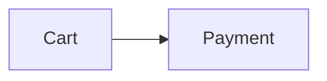

# Styled Markdown syntax reference (spec v1)

Everything in CommonMark + GitHub-Flavored Markdown is valid. This file lists every `.smd` addition with all attributes and allowed values.

## Contents

1. Front matter
2. Block containers (general rules)
3. Callouts and collapsibles
4. Layout: tabs, columns, cards, boxes, steps, timeline, figures
5. Project blocks: decision, risk, risk-matrix
6. Developer blocks: api, code fences, include
7. Audience blocks: agent, human
8. Inline: styled text, directives, math, footnotes
9. Tasks
10. Headings
11. Diagrams
12. Attribute lists and colors
13. Silencing validation rules

---

## 1. Front matter

```yaml
---
smd: 1                       # required in practice (validator suggests it)
title: Saved Searches        # rendered as the page title; don't repeat as "# H1"
summary: One or two sentences. Agents read this first.
status: draft                # draft | review | approved | deprecated | archived
owners: ["@alice", "@team"]  # list
audience: both               # humans | agents | both
tags: [search, q4]           # list
version: 0.3
created: 2026-09-01          # YYYY-MM-DD
updated: 2026-09-26          # YYYY-MM-DD
theme: auto                  # auto | light | dark (preview hint)
accent: indigo               # named color or #hex for headings/links
toc: true                    # table of contents after the header
related: [docs/other.smd]    # list of paths/URLs
---
```

Unknown keys are allowed (reported as hints).

## 2. Block containers — general rules

```text
:::name{attributes} Optional title
content (any Markdown, including other blocks)
:::
```

- Open with 3+ colons, the name, optional `{attrs}` **immediately** after the name, then an optional title (inline Markdown allowed).
- Close with a line of 3+ colons and nothing else. It closes the **innermost** open block.
- Nesting works at any depth. Writing outer blocks with more colons (`::::tabs`) is a readability convention.
- A `:::` inside a code fence never closes a block.
- Every block also accepts the style attributes from §12.

## 3. Callouts and collapsibles

| Name | Use for |
|---|---|
| `note` | Neutral remark |
| `info` | Background information |
| `tip` | Helpful advice |
| `success` | Done / good outcome |
| `warning` | Important caveat |
| `danger` | Hard constraint, breaking change, data loss |
| `question` | Unresolved decision (say who decides and by when) |

Attributes: `title`, `collapsible` (`{collapsible}` starts closed, `{collapsible=open}` starts open).

```markdown
:::warning{collapsible} Breaking change in v2
Details…
:::

:::details Full log
Collapsed until opened. Attributes: title, open.
:::
```

## 4. Layout

```markdown
::::tabs
:::tab npm
…
:::
:::tab pnpm
…
:::
::::

::::columns
:::column{width=60%}
…
:::
:::column
…
:::
::::

:::card{accent=green} Title
…
:::

:::box{bg=indigo align=center}
…
:::

:::steps
1. First
2. Second
:::

:::timeline
- [x] **2026-09-15** — Kickoff
- [ ] **2026-10-20** — Beta
:::
```

- `tab` must be directly inside `tabs`, and `column` directly inside `columns`.
- `column` `width`: a percentage (`30%`) or a ratio (`2`).
- `card` `accent`: a color.
- `steps` and `timeline` style the list they wrap. In a timeline, `[x]` items show as done.

### Figures and numbered references

````markdown
The flow is in :ref[fig-checkout]; limits are in :ref[tbl-limits].

:::figure{#fig-checkout} Checkout flow

:::

:::figure{#tbl-limits kind=table} Rate limits per plan
| Plan | Requests per minute |
| ---- | ------------------- |
| Free | 60                  |
:::
````

- `:::figure` wraps one image, diagram, table or code block. The title after the name (or `title="…"`) is the caption.
- Figures are numbered in document order, one counter per `kind`: `figure` (default) → Figure 1, `table` → Table 1, `listing` (code) → Listing 1.
- `:ref[id]` renders "Figure 2" as a link to the figure with `{#id}`; it may come before the figure. Give every figure you refer to an `{#id}` (e.g. `fig-…`, `tbl-…`, `lst-…`). An unknown id is a `figure/unknown-ref` warning; two figures with one id are `figure/duplicate-id`.
- Write `:ref[id]` instead of "the figure below": the numbers stay right when figures move.

## 5. Project blocks

```markdown
:::decision{status=accepted date=2026-09-08 owner=@maya} Use Postgres for saved searches
Why, and the alternatives considered.
:::

:::risk{impact=high likelihood=medium owner=@payments status=open} Apple Pay verification delays launch
Mitigation.
:::

:::risk-matrix Launch risks
:::
```

| Block | Attribute | Values |
|---|---|---|
| decision | `status` | proposed · accepted · rejected · superseded · deprecated |
| decision | `date` | YYYY-MM-DD |
| decision | `owner` | @name |
| risk | `impact`, `likelihood` | low · medium · high · critical |
| risk | `status` | open · mitigated · accepted · closed |
| risk | `owner` | @name |
| risk-matrix | title after the name | — (no body; draws this document's risks) |

`:::risk-matrix` draws an impact × likelihood grid of the `:::risk` blocks in the same document (closed ones left out), so set `impact` and `likelihood` on every risk: a missing level counts as medium. Leave its body empty. `smd risks DIR` lists the risks of many documents, highest impact × likelihood first.

## 6. Developer blocks

```markdown
:::api{method=POST path="/v1/orders" auth="bearer token"} Create an order
| Field | Type | Required | Notes |
| --- | --- | --- | --- |
| `items` | array | yes | |

**Responses:** `201` created · `422` validation errors
:::
```

- `method` (required): GET · POST · PUT · PATCH · DELETE · HEAD · OPTIONS · WS · RPC · EVENT
- `path` (required), `auth` (optional).

Code fence info string:

| Info | Effect |
|---|---|
| ```` ```ts ```` | Syntax highlighting |
| ```` ```ts title="src/app.ts" ```` | File-name header |
| ```` ```ts {2,5-7} ```` | Highlight lines 2 and 5–7 |
| ```` ```ts file="../src/app.ts" lines="10-24" ```` | Embed real source (the body must be empty). Paths are relative to the document and must stay inside the workspace. With `lines`, highlight numbers refer to file lines. |
| ```` ```mermaid ```` | Diagram |
| ```` ```math ```` | Display math |

### Include another document (1.6+)

```markdown
:::include{file="shared/terms.smd" section="Pricing" level=3}
See [Pricing](shared/terms.smd#pricing) in the shared terms.
:::
```

| Attribute | Meaning |
|---|---|
| `file` (needed) | The `.smd` document to include, relative to this one. Its body is used, without its front matter. |
| `section` | Only one section and its subsections: a heading's text or id, as `smd agent --section` matches it. |
| `level` | 1–6: the level the included top heading becomes, so it nests under the current heading (here `###` under a `##`). |

- Write shared text (terms, glossary, setup steps) once and include it instead of copying it.
- The body is **fallback text**, shown only where the file can't be included and by tools older than 1.6. Put a link to the file there.
- Paths inside the included file (links, images, code embeds, nested includes) stay relative to that file.
- Links in this document may point at included headings by id. An included heading whose id this document already uses is numbered (`#pricing-1`).
- Don't make include chains loop (`a.smd` → `b.smd` → `a.smd`); `smd validate` warns (`include/*`).

## 7. Audience blocks

```markdown
:::agent Implementation constraints
- Imperative, checkable rules for implementers and coding agents.
:::

:::human Why this matters
Context for people only. Agents skip it.
:::
```

`:::agent` is collapsed for humans in the preview and **always** included in agent views, even when only one section is requested.

## 8. Inline

| Syntax | Result |
|---|---|
| `[text]{color=red}` | Colored text. Style keys are listed in §12. |
| `==text==` | Highlight |
| `:badge[Beta]{color=amber}` | Pill label (`color`) |
| `:status[On track]{color=green}` | Status dot + label (`color`) |
| `:priority[P1]` | Priority pill: P0–P4 or critical/high/medium/low |
| `:due[2026-10-15]` | Due date: amber within 7 days, red when overdue |
| `:metric[42%]{label="Activation" delta="+3%" trend=up good=up}` | KPI tile. `trend`: up/down/flat; `good`: up/down (default up). `label` is expected. |
| `:progress{value=60 color=green label="6/10"}` | Progress bar (value 0–100) |
| `:kbd[Ctrl+Shift+P]` | Keyboard keys |
| `:mention[@team]` | Mention |
| `:ref[fig-checkout]` | "Figure 2", linked to the `:::figure{#fig-checkout}` (see §4) |
| `$E=mc^2$` / `$$ … $$` | Math (KaTeX). No space just inside the `$`; `$5 and $10` is not math. |

A directive's `:` must follow whitespace or opening punctuation, so `10:30` is safe.

### Footnotes (GFM, since 1.6)

```markdown
Retries are capped at five[^retries].

[^retries]: Five covers 99.9% of transient failures.
    Indent further lines and paragraphs by 4 spaces.
```

- Labels are numbers or words without spaces, matched case-insensitively. Numbering follows the first reference, and the footnotes render as a numbered section at the end with back links, as on GitHub.
- Put definitions at the end of the section that uses them, or of the document. An unreferenced definition is not shown (`footnote/unused`), a reference without a definition stays plain text (`footnote/undefined`), and a repeated label keeps its first definition (`footnote/duplicate`).
- Write definitions as sentences: renderers without footnotes show them as written, but read a one-word definition (`[^1]: Note`) as a link target.
- Agents see footnotes as written; `smd agent --section` adds the definitions a section's references need.

## 9. Tasks

```markdown
- [ ] Add idempotency keys :priority[P0] @api-team :due[2026-10-03]
- [x] Kickoff with design @sam
```

The owner (`@name` or `:mention[@name]`), priority and due date are extracted by `smd tasks` and `smd meta`. Overdue open tasks produce an info diagnostic.

## 10. Headings

```markdown
## Background {agent=skip}
## Installation {#install}
## Summary {.lead}
```

`agent=skip` omits the section, up to the next heading of the same or higher level, from agent views. It's the only allowed `agent` value.

## 11. Diagrams

The first non-comment line must be a Mermaid type: `flowchart` (or `graph`), `sequenceDiagram`, `classDiagram`, `stateDiagram-v2`, `erDiagram`, `journey`, `gantt`, `pie`, `quadrantChart`, `requirementDiagram`, `gitGraph`, `mindmap`, `timeline`, `sankey-beta`, `xychart-beta`, `block-beta`, `packet-beta`, `kanban`, `architecture-beta`, `C4Context`…

## 12. Attribute lists and colors

`{key=value key2="quoted value" .class #id flag}`

| Style key | Values |
|---|---|
| `color`, `bg`, `border` | Named color, `#hex`, `rgb()`, `hsl()` |
| `size` | xs · sm · md · lg · xl · 2xl |
| `weight` | normal · medium · bold |
| `font` | sans · serif · mono |
| `style` | italic · underline · strike |
| `align` (blocks) | left · center · right |

Named colors: `red` `orange` `amber` `yellow` `green` `teal` `cyan` `blue` `indigo` `purple` `pink` `gray` `muted` `accent`. They adapt to light and dark themes.

Any other key or value is a validation error and is dropped by renderers.

## 13. Silencing validation rules

Fix problems rather than silence them. When a finding is intended (a link to a file that is generated later, an example of a broken diagram), silence only that rule, on the fewest lines:

```markdown
<!-- smd-disable-next-line link/missing-file -->
See the [generated report](build/report.html).

<!-- smd-disable mermaid/* -->
…a section of deliberately broken diagrams…
<!-- smd-enable mermaid/* -->
```

- `smd-disable-next-line` covers the line below, `smd-disable-line` its own line, and `smd-disable` … `smd-enable` a range.
- Codes are separated by spaces or commas and may be `category/*`. No codes silences every rule, which is rarely what you want.
- An unknown code is reported as `rules/unknown`.
- Project-wide settings belong in `smd.config.json` (`{"rules": {"link/missing-file": "off"}}`), not in comments.
